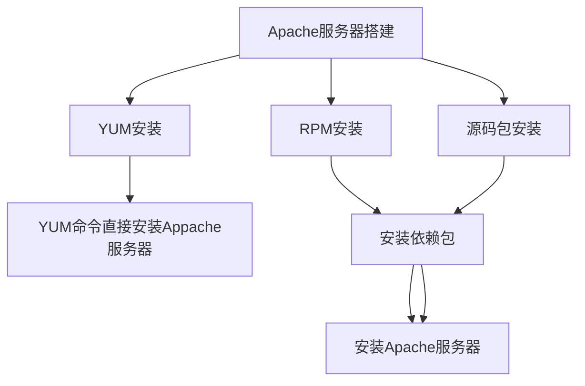

[toc]

# Linux 软件安装与进程管理

通过对 Apache 服务器的安装，了解 Linux 系统软件包的种类与使用，掌握 RPM 和 SRPM 的根本区别与使用环境，掌握 YUM 工具的使用与管理，熟悉进程管理与线程控制方法。在任务实施过程中：

- 了解软件包管理的区别；
- 熟悉进程管理操作；
- 掌握 YUM 命令的使用。




## 软件包管理

### 1. 软件包管理简介

软件包管理一般指系统中软件的安装、卸载和更新的功能。

1. 软件包：目前 Linux 最流行的两种软件管理机制分别为 DPKG 和 RPM。

   | 软件管理机制 | 使用命令     | 命令机制      | 软件包 | 适用操作系统    |
   | ------------ | ------------ | ------------- | ------ | --------------- |
   | RPM          | rpm,rpmbuild | YUM (yum)     | rpm    | CentOS, Red Hat |
   | DPKG         | dpkg         | APT (apt-get) | deb    | Ubuntu          |

   1. Linux 软件包 分为两种：
      - 二进制软件包，可直接安装运行，但看不到源程序，且下载时要注意这个软件是否适合所有平台，否则将无法正常安装。如 .deb 类型文件在 CentOS 系统中不能正常安装；
      - 源码包，解开包后，还需要使用编译器将其编译成位可执行文件。
   2. Linux 常用的软件包有两种，分别是 tar 包和 RPM 包。
      - tar 包：tar 是 Linux 使用非常广泛的文档打包风格。通常用 tar 方式打包的都是**源码包**，在进行文档打包时消耗非常少的 CPU 和时间。注意 tar 只是一个打包工具，不能进行文档压缩。
      - RPM 包：RPM（Red Hat Package Manager）是 Red Hat 公司推出的包管理器。使用它可以很容易地对 rpm 形式的软件包进行安装、升级、卸载、验证、查询等操作。RPM 有二进制软件包，也有源码包。
   
2. 软件库：
   国内部分软件库服务器

   | 服务器名称             | 服务器地址                                       |
   | ---------------------- | ------------------------------------------------ |
   | 阿里云计算             | https://mirrors.aliyun.com/centos/               |
   | 北京理工大学           | https://mirror.bit.edu.cn/centos/                |
   | 北京 Teletron 电信工程 | https://mirrors.btte.net/centos/                 |
   | 重庆大学               | https://mirrors.cqu.edu.cn/centos/               |
   | CN99 公司              | https://mirrors.cn99.com/centos/                 |
   | 大连东软信息学院       | https://mirrors.neusoft.edu.cn/centos/           |
   | huaweicloud            | https://mirrors.huaweicloud.com/repositon/centos |
   | 兰州大学开源社区       | https://mirrors.lzu.edu.cn/centos/               |
   | 南京大学               | https://mirrors.nju.edu.cn/centos                |
   | 南京邮电大学           | https://mirrors.njupt.edu.cn/centos/             |
   | 网易                   | https://mirrors.163.com/centos/                  |
   | 上海交通大学           | https://ftp.sjtu.edu.cn/centos/                  |
   | 上海大学开源社区       | https://mirrors.shu.edu.cn/centos/               |

   每个 Linux 系统还有对应的第三方库，这些库中的软件包因为需要收费或专利等原因不存放在公开的软件中心库。想要使用这些库需要充分了解其使用规则后通过手动添加的方式把软件包位置加入文件管理系统的配置文件中。

3. 软件依赖：各个软件需要相互依赖才能够完成所需工作。在 Linux 系统中 ，安装 Apache 服务器就需要用到 Socker 控制包 apr 和 apr-util 软件包等。

### 2. RPM 软件包

RPM 会将要安装的软件先编译，然后打包成 RPM 机制可以运行安装的包文件，**能够分析出该软件安装所需的依赖环境**，当不满足这些环境的时候，就会提示需要安装的依赖包，直到满足条件才会安装。

1. RPM 包介绍：**获取本地软件包**，在安装前需要准备好所需软件安装包。
   二进制安装包，即预编译包，只有在相同的 Linux 环境下才可以通过。
   没有进行编译的源码包， SRPM，可以在不同的 Linux 环境下使用，可自定义编译参数。

2. wget 软件下载：wget 工具下载所需软件包，从指定的 URL 下载文件并且性能稳定。

   `wget [选项] URL`

   wget 命令下载选项

   | 选项                    | 作用                     |
   | ----------------------- | ------------------------ |
   | 为空                    | 直接下载内容无其他限制   |
   | -v, --verbose           | 详细的输出（此为默认值） |
   | -c, --continue          | 断点续传下载文件         |
   | -4, --inet4-only        | 仅连接至 IPv4 地址       |
   | -6, --inet6-only        | 仅连接至 IPv6 地址       |
   | -nd, --no-directories   | 不创建目录               |
   | -x, --force-directories | 强制创建目录             |
   | --no-check-certificate  | 不要验证服务器的证书     |
   | --no-cookies            | 不使用 cookies           |
   | --header= 字符串        | 在头部插入（字符串）     |
   | -b, --background        | 启动后转入后台           |

   例 1：下载 JDK
   `cd 目录 # 选择对应目录`

   ```
   wget --no-check-certificate --no-cookies --header "Cookie: oraclelicense=accept-securebackup-cookie" https://download.oracle.com/otn-pub/java/jdk/13.0.2+8/d4173c853231432d94f001e99d882ca7/jdk-13.0.2_linux-x64_bin.rpm
   ```

3. RPM 包安装：
   使用`rpm`命令安装软件需要到软件包所在目录执行对应的安装命令才能正确安装所需软件，命令格式如下：
   `rpm [选项] 软件包`
   rpm 命令安装常用选项

   | 选项          | 作用                                         |
   | ------------- | -------------------------------------------- |
   | -i, --install | 安装软件                                     |
   | -v, --verbose | 打印详细信息                                 |
   | -h, --hash    | 显示安装进度（需要和 -v 一起使用）           |
   | --replacepkge | 重新安装已安装的软件                         |
   | --test        | 测试是否可以被安装 不实际安装                |
   | --nodeps      | 忽略软件的属性相依赖，强行执行               |
   | --force       | 忽略软件包和文件的冲突，覆盖已有的程序或文件 |

   例 2：

   ```
   cd /dir # 切换到安装包所在的目录
   rpm -ivh 安装包名字
   rpm -ivh --prefix= /opt  xxx.rpm # /opt 即为自定义安装目录
   ```
   
   rpm 包默认安装路径:
   
   | 文件类型       | 文件安装目录   |
   | -------------- | -------------- |
   | 配置文件       | /etc           |
   | 可执行文件     | /usr/bin       |
   | 程序使用函数库 | /usr/lib       |
   | 软件使用手册   | /usr/share/doc |
   | 帮助文件       | /usr/share/man |
   
4. RPM 包更新：软件的版本更新：
   `rpm [选项]vh 软件包`
   
    rpm 更新命令选项

| 选项                         | 描述                               |
| ---------------------------- | ---------------------------------- |
| -U, --upgrade\<packagefile>+ | 升级软件（若没有安装过则直接安装） |
| -F, --freshen\<packagefile>+ | 升级软件（若没有安装过则不安装）   |

   

5. RPM 包查询：查询当前系统所安装软件包
   `rpm [选项] 软件包`
   rpm 查询选项

   | 选项       | 描述                     |
   | ---------- | ------------------------ |
   | -q         | 仅查询，后面加软件名称   |
   | -qa        | 列出所有已安装软件       |
   | -qi        | 列出该软件的详细信息     |
   | -ql        | 列出该软件包含的所有文件 |
   | -qf        | 查询某个文件属于某个软件 |
   | --requires | 显示包的依赖关系         |

   例 1：查看当前系统所有版本的某一软件
   `rpm -qa | grep java # grep 是搜索命令 后面加软件名，可以搜索到包含这个名字的软件版本` 

6. RPM 包验证：查看那些软件的哪些文件被改动过。
   `rpm [选项] 软件包`

   | 选项 | 描述                             |
   | ---- | -------------------------------- |
   | -V   | 若该软件有文件被更改就会显示出来 |
   | -Va  | 列出所有可能被更改的文件         |
   | -Vf  | 查看某个文件是否被更改           |

   

7. rpm 卸载：卸载 rpm 软件包
   `rpm [选项] 软件包`

   | 选项        | 描述       |
   | ----------- | ---------- |
   | -e, --erase | 删除软件   |
   | --nodeps    | 忽略依赖   |
   | --force     | 强制操作   |
   | --test      | 预演、测试 |

### 3. 源码包

Linux 源码包比 rpm 包安装自由度更高，但源码包安装速度慢，安装过程中容易报错。源码包是开源的，用户可以收工配置相应参数安装到指定位置。

1. tar 源码包：使用 tar 工具打包生成的压缩包通常称为 tar 包。tar 包通常是以 .tar 结尾的文件，但也有以其他格式结尾的文件（如 tar.gz， tar.bz2），不同的结尾方式主要是因为不同的压缩指令及不同的压缩算法。
   由于 tar 压缩的都是源码包，解压后不能直接应用，需要对源码包进行编译配置才能应用。Linux 系统中使用 **autoconf** 工具（用于生成可以自动地配置软件源代码包以适应多种 Unix 系统的 shell 脚本的工具）下的`configure`脚本配置工具编译安装源码。在安装源码包时，解压缩源码包后，进入源码包下使用`./configure`对即将安装的软件进行配置，命令格式如下：
   `./configure [选项]`
   configure 选项

   | 选项                    | 作用                                                         |
   | ----------------------- | ------------------------------------------------------------ |
   | -prefix=\<path>         | Nginx 安装路径。如果没有指定，默认为 /usr/local/nginx        |
   | -sbin-path=\<path>      | Nginx 可执行文件安装路径。只能安装时指定，如果没有指定，默认为 \<prefix> /sbin/nginx |
   | -conf-path=\<path>      | 在没有给定 -c 选项下默认的 nginx.conf 的路径。如果没有指定，默认为 \<prefix> /conf/nginx.conf |
   | -pid-path=\<path>       | 在 nginx.conf 中没有指定 pid 指令的情况下，默认的 nginx.pid 的路径。如果没有指定，默认为 \<prefix> /conf/nginx.conf |
   | -lock-path=\<path>      | nginx.lock 文件的路径                                        |
   | -error-log-path=\<path> | 在 nginx.conf 中没有指定 error_log 指令的情况下，默认的错误日志的路径。如果没有指定，默认为 \<prefix> /logs/error.log |
   | -user=\<user>           | 在 ngnix.conf 中没有指定 user 指令的情况下，默认的 nginx 使用的用户。如果没有指定，则默认为 nobody。 |
   | -builddir=DIR           | 指定编译的目录                                               |
   | --enable-static         | 生成静态链接库                                               |
   | --enable-shared         | 生成动态链接库                                               |

   使用`./configure`对所选装软件配置完成后就生成一个对应的 `makefile`文件，然后分别使用`make`命令来编译源代码，使用`make install`命令进行软件安装，最后可以使用`make clean`命令删除编译产生的可执行文件及其目标文件。

2. SRPM 包：source rpm，即 rpm 包里面包含有源码（source code）。srpm 内容是源码，但是也还有该套件所需要的依赖套件说明，以及所有 rpm 包所提供的数据。与 rpm 包不同的是，它提供了**参数设定档案**（configure 与 makefile）。所以如果下载的是 srpm，安装该套件时，rpm 套件管理员会先将该套件以 rpm 包管理方式编译，然后将编译完成的 rpm 安装到 Linux 系统中。与 rpm 包相比，**srpm多了一个重新编译的动作，而且 srpm 编译完成会产生 rpm 档案包。**

   1. SRPM 的用处：通常一个套件在解压时，会同时解压出该套件的 rpm 与 srpm。rpm 包必须要在相同的 linux 环境下才能够安装。srpm 作为源码格式，可以通过修改 srpm 内的参数设定档案，重新编译产生能够适合当前 linux 版本的 rpm 包，最终将该文件安装到系统中，而不必与原作者打包的 linux 环境相同。 

   2. srpm 环境配置：rpm 有两种，一种是预编译的，源码包的后缀是 .src.rpm。想要产生源码包，需要通过 srpm 包重构出 rpm 包。重构初 rpm 包的环境为 `rpmbuild`。Linux 系统本身没有 rpmbuild 命令，需要通过 yum 安装：
      `yum install rpm-build`
      安装完成后可以使用 rpmbuild 命令进行 .src.rpm 格式文件的创建：
      `rpmbuild [选项] 文件包`

      | 选项 | 说明                                                        |
      | ---- | ----------------------------------------------------------- |
      | -bp  | 只执行 spec 的 %pre 段（解开源码包并打补丁，即只做准备）    |
      | -bi  | 执行 spec 中 %pre，%build 与 %install（准备，编译，并安装） |
      | -bl  | 检查 spec 中的 %file 段（查看文件是否齐全）                 |
      | -bb  | 只建立二进制包（常用）                                      |
      | -bs  | 只建立源码包                                                |

   3. 生成 rpmbuild 的工作目录：
      `rpmbuild --showrc| grep topdir`

      rpmbuild 工作目录作用

      | 目录名称 | 说名                                     |
      | -------- | ---------------------------------------- |
      | BUILD    | 打包过程中的工作目录                     |
      | PRMS     | 存放生成的二进制包                       |
      | SOURCES  | 放置打包资源，包括资源打包文件和补丁文件 |
      | SPECS    | 放置 SPEC 文档                           |
      | SRPMS    | 存放生成的源码包                         |

      

## YUM

### 1. 简介

Yellow dog Updater, Modified，是基于 rpm 的升级版软件包管理器，可以自动处理依赖性关系，并一次性安装所有依赖的软件包。
`yum [选项] (参数) 软件包`
yum 常用选项

| 选项          | 描述                 |
| ------------- | -------------------- |
| 为 空         | 不进行设置           |
| -e            | 设置错误等级（0-10） |
| -d            | 设置调试等级（0-10） |
| -t            | 忽略错误             |
| -R[minutes]   | 设置等待时间         |
| -y            | 自动应答 yes         |
| -q            | 安静模式             |
| -v            | 详细模式             |
| --skip-broken | 忽略依赖问题         |
| --nogpgcheck  | 忽略 GPG 验证        |

yum 常用参数说明

| 参数         | 说明                                      |
| ------------ | ----------------------------------------- |
| install      | 安装 rpm 软件包                           |
| update       | 更新 rpm 软件包                           |
| check-update | 检查是否有可用的更新 rpm 包               |
| remove       | 删除指定的 rpm 软件包                     |
| list         | 显示软件包的信息                          |
| search       | 检查软件包的信息                          |
| info         | 显示指定的 rpm 软件包的描述信息和摘要信息 |
| clean        | 清理 yum 过期的缓存                       |
| shell        | 进入 yum 的shell 提示符                   |
| resolvedep   | 显示 rpm 软件包的依赖关系                 |
| localinstall | 安装本地的 rpm 软件包                     |
| localupdate  | 显示本地 rpm 软件包进行更新               |
| deplist      | 显示 rpm 软件包的所有依赖关系             |

### 2. yum 软件管理

1. yum 软件安装：不需要预先下载所需的安装包，只要在网络 yum 库存在的软件包，通过指令可直接进行下载安装。以安装 MySQL 数据库为例。
   `yum -y install mysql-community-server`
2. yum 软件升级：
   `yum update mysql`
3. yum 查询：
   `yum search mysql`


## 进程管理与线程管理

Linux 是一个多任务的操作系统。在一个系统上可以有多个进程同时进行服务。一个程序的运行同样需要多条进程支持。

> 一个进程至少有一个线程。进程是资源分配的基本单位，线程是调度的基本单位。

### 1. 进程

进程是一个正在运行的实体程序或命令，每一个进程都有自己的地址空间，并且占用一定的系统资源。所有的进程都有三种状态，分别为**运行态**、**就绪态**和**阻塞态**。

- 运行态：程序当前实际占用 CPU 等资源的状态；
- 就绪态：程序除 CPU 以外所有的资源都已准备就绪的状态；
- 程序在运行过程中由于需要请求外部资源而无法继续执行，需要等待所需资源的状态。

进程有三种状态是因为程序之间可能存在互斥性。互斥就是某资源同一时间仅允许一个进程访问，另一个进程需等待上一个进程完成，比如打印机一次只能打印一个文档。进程存在互斥性的同时也存在同步性。同步性是指多个进程通过互相合作共同完成相同的任务。

用户对进程有一定管理权限，常用进程管理有进程查看、进程终止和进程优先级调整。

1. 进程查看：查看静态进程和动态进程。

   1. 静态进程：
      `ps [选项]`
      静态进程查询常用选项（单横线代表短格式，不加短横线与加段横线意义不同）

      | 选项 | 说明                                                   |
      | ---- | ------------------------------------------------------ |
      | -A   | 所有的静态进程均显示出来                               |
      | -a   | 显示现行终端机下的所有静态进程，包括其他用户的静态进程 |
      | -u   | 以用户为主的静态进程状态                               |
      | x    | 通常与 a 这个参数一起使用，可列出较完整的信息          |
      | -l   | 较长、较详细地将该 PID 的信息列出                      |
      | j    | 工作的格式                                             |
      | -f   | 做一个更为完整的输出                                   |
      | -e   | 与 -A 具有同样的效果，所有的静态进程均显示出来         |
      | axu  | 列出所有正在内存中的程序                               |

      例 1：目前本用户登陆的 PID（进程的 ID 号）：
      `ps -l`

      例 2：列出所有正在内存中的程序：
      `ps aux`

   2. 动态进程：
      显示系统中各个进程的资源占用状况，与 Windows 系统下的任务管理器相似。Linux 只能通过命令查看当前该系统动态进程的情况。`top`命令能够实时地对系统状态进行动态监控，默认按照 CPU 使用情况对动态进程排序。命令格式如下：
      `top [选项]`
      动态进程查询常用选项

      | 选项        | 说明           |
      | ----------- | -------------- |
      | -b          | 批处理         |
      | -c          | 显示完整的命令 |
      | -i<时间>    | 设置时间间隔   |
      | -I          | 忽略失效进程   |
      | -s          | 保密模式       |
      | -S          | 累积模式       |
      | -u <用户名> | 指定用户名     |
      | -p <进程号> | 指定进程       |
      | -n <次数>   | 循环显示的次数 |

      

2. 进程终止：`kill`命令删除和终止进程：

   `kill [选项] PID`
   删除进程常用的选项

   | 选项  | 说明                                                   |
   | ----- | ------------------------------------------------------ |
   | 为 空 | 直接终止进程                                           |
   | -a    | 当处理当前进程时，不限制命令名和进程号的对应关系       |
   | -l    | 若不加<信息编号>选项，则 -l 参数会列出全部的信息名称   |
   | -p    | 指定 kill 命令值打印相关进程的进程号，而不发送任何信号 |
   | -s    | 指定要送出的信息                                       |
   | -u    | 指定用户                                               |

   `kill`命令在使用前需要查询想要终止的进程的 PID，比较麻烦。实际工作中 PID 输入错误会发生不可估量的损失。想要终止进程还有第二种指令方式，通过进程名进行进程管理而不是通过 PID：
   `kill [选项] 进程名`
   `killall`命令常用选项

   | 选项  | 说明                           |
   | ----- | ------------------------------ |
   | 为 空 | 直接终止进程                   |
   | -e    | 要求匹配进程名称               |
   | -I    | 忽略小写                       |
   | -g    | 杀死进程组而不是进程           |
   | -i    | 交互模式，杀死进程前先询问用户 |
   | -l    | 列出所有的已知信号名称         |
   | -q    | 不输出警告信息                 |
   | -v    | 报告信息是否成功发送           |
   | -w    | 等待进程死亡                   |

    

3. 进程文件查看：Linux 系统运行相应功能就会打开对应的文件，功能是通过进程实现的。当前运行进程打开的文件就是系统运行打开的文件。`lsof`命令就是查看系统所有打开文件的指令，全称为“list open files”。此命令只能通过最高权限用户执行。命令格式如下：
   `lsof [选项]`

4. 进程优先级调整：
   `ps`命令查看优先级时，输出结果在其中一个 NI 字段带表的就是进程优先级，进程优先级的取值时 -20 ~ 19，数值越大优先级越低，执行次数越少。如果进程启动时没有设置优先级，默认为 0。普通用户可以为自己的进程设置优先级保证任务尽快完成，但不能低于 0。修改优先级的三种命令方式分别如下：

   1. 在启动进程的同时对进程赋予优先级：
      `nice -n [优先序] 待启动进程`

   2. 对已启动进程的优先级进行修改，根据进程的 PID、进程群组和进程所有者进行修改。命令格式如下：
      `renice [优先序] [选项]`
      renice 命令常用选项

      | 选项    | 说明                                                         |
      | ------- | ------------------------------------------------------------ |
      | -p pid  | 重新指定进程 id 为 pid的进程的优先序                         |
      | -g pgrp | 重新指定进程群组（process group）的 id 为 pgrp 进程（一个或多个）的优先序 |
      | -u user | 重新指定进程拥有者为 user 的进程的优先序                     |

   3. `top`：在 top 命令界面中 键入`r`键出现`PID to renice`指示，并输入需要修改的进程的 PID，然后显示`renice PID *** to value`，在后面输入修改后的优先序即可。

### 2. 线程

Linux 中线程本身不存在，线程是通过进程模拟产生的。线程的工作主要是承担任务调度，一个进程可以拥有多个线程。通常把线程分为三类：用户级线程、内核级线程、混合线程。

1. 用户级线程：不需要内核支持，不依赖于操作系统的核心，而是在用户程序中运行实现的线程。用户线程的控制需要线程库提供创建、同步、调度和管理等方式实现。用户级线程仅存在于用户空间。用户级线程的优点如下：
   - 可以在不支持线程的操作系统中实现；
   - 创建和销毁线程、线程切换等线程管理的代价比内核线程少得多。因为保存线程状态的过程和调用程序都只是本地过程；
   - 允许每个进程定制独立的调度计算，线程管理比较灵活；
   - 线程能够利用的表空间和堆栈空间比内核级线程多；
   - 不需要陷阱，不需要上下文切换，也不需要对内存高速缓存进行刷新，使得线程调用非常便捷；
   - 线程的调度不需要内核直接参与，控制简单。
2. 内核级线程：线程的创建、撤销和切换等都需要内核直接实现。这些线程可以在全系统内进行资源竞争。内核空间为每个内核支持线程设置线程控制模块，内核根据该控制模块感知并控制线程。内核级线程有点如下：
   - 多处理器系统中，内核能够并行执行统一进程内的多个线程；
   - 如果进程中的一个线程被阻塞，能够切换同一进程内的其他线程继续执行（这是用户级线程的一个缺点）；
   - 所有能够阻塞线程的调用都以系统调用的方式实现，代价可观；
   - 当一个线程阻塞时，内核根据选择可以运行另一个进程的线程。而用户空间实现的线程中，运行时系统时钟运行自己进程中的线程。
3. 混合线程：用户级线程和内核级线程的组合，通过 POSIK 线程调度灵活方便。

## 任务 5. 分别使用 yum 工具， rpm 二进制包和源码包安装 apache 服务器，体验不同命令的优缺点。

1. yum 安装 apache 服务器：
   `yum install httpd`

2. 启动 httpd 服务，通过浏览器登陆 `127.0.0.1`，查看是否登陆成功:
   `service httpd start`

3. 查看当前系统进程：
   `ps aux`

4. 使用 killall 命令终止 httpd 进程，查看进程结果，并刷新浏览器确认：
   `killall httpd`

5. yum 卸载 httpd 包与其依赖包：
   `yum remove httpd`
   `yum remove httpd apr`

6. 创建软件包存储目录，并下载所需 httpd 软件包及其依赖包至此目录下：
   `mkdir /usr/local/httpd`
   `cd /usr/local/httpd`
   `wget httpd.rpm`
   `wget httpd-tool.rpm`
   `wget apr.rpm`
   `wget apr-util.rpm`

7. 使用 rpm 命令安装 httpd 及其依赖包，其中`\`命令将一条命令拆分为多行：

   ```
   rpm -ivh \
   > apr.rpm \
   > apr-util.rpm \
   > httpd.rpm  \
   > httpd-tools.rpm
   ```

8. 启动 httpd 服务，通过浏览器验证是否成功：
   `service httpd start`

9. 使用 rpm 命令卸载软件包及其依赖包，并刷新浏览器：
   `rpm -e apr`
   `rpm -e httpd`

10. 下载源码格式的软件包及其依赖包到 `/usr/local/httpd`目录下：

    ```
    wget http://mirrors.aliyun.com/apache/httpd/httpd
    wget http://mirrors.aliyun.com/apache/apr/apr
    wget http://mirrors.aliyun.com/apache/apr/apr-util
    ```

11. 解压下载的 httpd 软件包及其依赖包到当前目录下，命令如下所示：

    ```
    tar -zxvf
    ```

12. 配置安装 httpd 依赖包：

    ```
    cd /usr/local/httpd/apr
    ./configure --prefix=/usr/local/apr
    make && make install
    ```

13. 配置安装 httpd 依赖包 apr-util:

    ```
    cd /usr/local/httpd/apr-util
    ./configure --with-apr=/usr/local/apr --prefix=/usr/local/apr-util
    make && make install
    ```

14. 复制所需依赖包到 httpd 软件包目录下：

    ```
    cd .. # 这一步之后退回到 httpd 的目录
    cp -r apr-版本号 /usr/local/httpd/httpd-版本号/srclib/apr
    cp -r apr-util-版本号 /usr/local/httpd/httpd-版本号/srclib/apr-util
    ```

15. 进入 httpd 目录下，配置并安装 httpd 服务器:

    ```
    cd httpd-版本号
    ./configure --with-apr=/usr/local/apr --with-apr-util=/usr/local/apr-util --prefix=/usr/local/apache --sysconfdir=/etc/httpd --enable-so --enable-rewrite --enable-ssl --enable-cgi --enable-cgid --enable-modules=most --enable-mods-shared=most --enable-mpms-shared=all -with-included-apr
    make && make install
    ```

16. 启动 Apache 服务器并通过 80 端口（http 服务端口）和浏览器验证安装结果：

    ```
    /usr/local/apache/bin/apachectl start
    lsof -i:80
    ```

    

# Linux 网络服务

通过对网络服务的学习，了解防火墙的基本原理、ssh 协议的工作机制，了解**规则链**和**安全上下文**的概念，掌握防火墙的基础操作。在任务实现过程中：

- 了解防火墙的过滤方法；
- 熟悉三种安全机制的使用；
- 掌握 ssh 服务的使用方法；
- 具有使用防火墙保护本机数据的能力。

## 网络配置

### 1. ifconfig 文件介绍

Linux 系统中用于显示或对网络设备进行修改（网络接口卡）的命令：
`ifconfig`

网络配置说明

| 配置      | 说明                     |
| --------- | ------------------------ |
| ens33     | CentOS 7 中默认网卡名    |
| mtu       | 最大传输单元，单位为字节 |
| inet      | IP 地址                  |
| netmask   | 子网掩码                 |
| broadcast | 广播地址                 |
| lo        | 代表 localhost 本机      |

### 2. 网络配置修改

为了使主机进行高性能的网络连接，也为了提高主机的可管理性，会对网络进行如下所示的配置：

```
vim /etc/sysconfig/network-scripts/ifcfg-ens32

# 将配置文件修改为如下内容
DEVICE=ens32
ONBOOT=yes
BOOTPROTO=static
IPADDR=192.168.10.110
NETMASK=255.255.255.0
GATEWAY=192.168.10.1
DNS1=114.114.114.114
```

网卡属性详解

| 属性    | 说明                                                         |
| ------- | ------------------------------------------------------------ |
| DEVICE  | 设备名称                                                     |
| IPADDR  | 网卡绑定协议，有 none（不指定）、static（静态 IP）、dhcp（动态 IP） |
| NETMASK | 子网掩码                                                     |
| GATEWAY | 网关，该网关的第一个 IP                                      |
| ONBOOT  | 是否开机启动                                                 |
| DNS1    | 域名解析服务器                                               |

修改完成后，可将端口停用后重启或重启网络服务使网卡配置生效。两种方法达到的效果相同，但是第一种方法不能使用远程操作，因为端口在停用后远程连接自然会中断，所以之后的启动操作也无法进行。第二种方法虽然也经历了连接断开的情况，但该方法会自动重启网络服务，一段时间后使用新 IP 重新连接即可。

重启网络服务：
`systemctl restart network service`

### 3. Linux 主机名修改

Linux 系统中的主机名本质上是一个 kernel 变量，可通过`hostname`命令查看本机主机名：
`hostname`

必要情况下可通过 /etc/ 目录下的 hostname 文件修改本级主机名，修改完成后需要重启系统使之生效：

```
vim /etc/hostname
reboot
```

## ssh 远程服务

### 1. 远程服务

通过自己使用的计算机去对目标计算机或者服务器进行访问并取得计算机控制权的一种服务。

**作为对另一台计算机或者服务器访问的操作，一定要保证远程服务的安全性**。

### 2. ssh

secure shell，是一种建立在应用层基础上的安全协议，通过数据封包加密技术，将等待传输的数据封包加密后再传输到网络上，因此数据安全性较高。简而言之，ssh 是一种用于计算机之间加密登陆的安全协议。

1955年，芬兰人设计了 ssh 协议，将登陆的信息全部加密，并在世界范围内推广。

ssh 共分为两个版本，ssh1 和 ssh2。ssh1 和 ssh2 最大的不同之处在于 ssh2 对 ssh1 的算法问题进行了修复，可以更加有效地保护传输的安全性。

### 3. 工作机制


ssh 能够保持网络通信安全的原因是采用了**密钥加密**。

公钥：提供给远程主机（自己在用的计算机）进行数据加密的行为，即，远程主机通过目标计算机（云端的计算机，被控制的计算机）提供的公钥进行数据加密。

私钥：私钥与公钥一一对应，通过公钥加密的信息，只有通过对应的私钥才可以解密。所以私钥是不能外流的，只能保存在自己的主机上。

ssh 的工作流程分为 5 步：

1. 第一次启动服务器时，服务器会自动产生公钥和私钥（服务器公私钥）；
2. 客户端请求连接服务器时，客户端想要连接到 ssh 服务器，就需要使用适当的 ssh 工具来联机；
3. 服务器将服务器公钥传送给客户端；
4. 客户端记录服务器的公钥，将公钥保存。如果客户端第一次连接到服务器，客户端会将服务器公钥保存；如果不是第一次连接到服务器，则会将之前存储的服务器公钥与当前的服务器公钥进行比对，查看是否有差异。如果接收公钥数据，则开始计算客户端自己的公钥和私钥；
5. 客户端将自己的客户端公钥传到服务器，服务器对客户端公钥进行保存。如果服务器不是第一次连接客户端，就会将收到的客户端公钥与已存在服务器上的客户端公钥进行对比。经确认后连接成功。


### 4. 终端仿真工具

在 windows 环境中模拟 Linux 终端的工具。终端仿真工具通常使用 ssh 协议来完成 windos 和 linux 之间的数据传输安全。一旦使用终端仿真工具登录到服务器中，就可以在终端仿真工具内进行对 linux 服务器的操作。常用的终端仿真工具有 Xshell 和 SecureCRT。

1. Xshell：
2. SecureCRT：通过独有的 VCP 命令程序对文件进行加密传输。


## iptables 包过滤器

### 1. 防火墙简介

防火墙是内部网络与外部网络之间的一道屏障，可防止不可预测的具有破坏性的非法侵入，能根据安全策略控制（允许、拒绝、监测）出入网络的信息流，且本身具有较强的抗攻击能力。它是提供信息安全服务、实现网络和信息安全的基础设施。

iptables 作为 CentOS 系统中必不可少的包过滤系统，用户可以设计自己的出入站规则，控制指定程序后端能否被外部主机访问，从而提高本机的安全性。

- 出站：本机访问外部网络；
- 入站：外部网络中的主机通过网络访问本机。

### 2. iptables 命令选项

在通常情况下管理员需要使用 iptables 命令添加、删除防火墙，iptables 语法格式：
`iptables --help`
`iptables [-t table] command [match] [-j]`

1. -t table：指定将操作的规则表，内建规则表有 4 个：filter、nat、mangle、raw。当未指定规则表时默认对 filter 进行操作。iptables 表由 5 个规则链组成：

   | 规则链      | 说明             |
   | ----------- | ---------------- |
   | INPUT       | 处理输入数据包   |
   | OUTPUT      | 处理输出数据包   |
   | FORWARD     | 处理转发数据包   |
   | PREROUTING  | 用于目标地址转换 |
   | POSTROUTING | 用于源地址转换   |

   规则表功能如下：

   - filter：默认规则表，拥有 INPUT、FORWARD 和 OUTPUT 三个规则链，用于完成分包过滤的动作；
   - nat：由PREROUTING 和 POSTROUTING 两个规则链组成，主要完成一对一、一对多、多对多等网址转换工作；
   - mangle：由PREROUTING、FORWARD、POSTROUTING 三个规则链组成。除了进行网址转换工作外，还能够改写封包或者设定 MASK（将封包做记号，以进行后续的过滤），效率较低。
   - raw：由 PREROUTING 和 OUTING 两个规则链组成，常用于地址的过滤，因为优先级最高，从而可以对收到的数据包在连接跟踪前进行处理。

2. command：用来指定对规则链的操作，如新增规则到指定规则链中或删除规则链中的一条规则等常用参数如下：
   iptables 的参数

   | 参数 | 范例                                       | 说明                                                 |
   | ---- | ------------------------------------------ | ---------------------------------------------------- |
   | -A   | iptables -A INPUT ...                      | 追加规则到指定规则链中                               |
   | -D   | iptables -D INPUT --dport 80 -j DROP       | 从某个规则链中删除一条规则，可指定完整规则或规则编号 |
   | -R   | iptables -R INPUT 1 -s 192.168.0.1 -j DROP | 替换指定行规则，规则被替换后并不会改变顺序           |
   | -I   | iptables -I INPUT 1 --dport 80 - j ACCEPT  | 插入一条规则                                         |
   | -L   | iptables -t nat -L                         | 列出指定表中所有的规则                               |
   | -F   | iptables -F INPUT                          | 删除指定链的所有规则                                 |
   | -N   | iptables -N allowed                        | 定义新的规则链                                       |
   | -X   | iptables -X allowed                        | 删除某个规则链                                       |

3. match：数据在通信系统中传出之前需要将其切割为数据块，这个切割过程称为**封包**。该选项主要用来对封包进行匹配。常用封包参数如下：

   | 参数    | 范例                                | 说明                                                         |
   | ------- | ----------------------------------- | ------------------------------------------------------------ |
   | -p      | iptables -A INPUT -p tcp            | 匹配通信协议类型是否相符                                     |
   | -s      | iptables -A INPUT -s 192.168.1.1    | 用来匹配封包的 IP 来源                                       |
   | -d      | iptables -A INPUT -d 192.168.1.1    | 用来匹配封包的目的地 IP                                      |
   | -i      | iptables -A INPUT -i ens32          | 用来匹配封包的传入网卡，可以使用通配符 + 来做大范围匹配，如：-i eth+ |
   | -o      | iptables -A FORWARD -o eth0         | 用来匹配封包的传出网卡                                       |
   | --sport | iptables -A INPUT -p tcp --sport 22 | 用来匹配封包的源端口，可以匹配单一端口，或是一个范围         |
   | --dport | iptables -A INPUT -p tcp --dport 22 | 用拍匹配封包的目的地端口号                                   |

4.  -j：该参数可指定将要进行的处理动作
   iptables 常用的处理动作

   | 动作     | 说明                                                 |
   | -------- | ---------------------------------------------------- |
   | ACCEPT   | 放行封包，而后将不再匹配其他规则                     |
   | REJECT   | 阻拦该封包并将可传送的封包通知对方                   |
   | DROP     | 将封包丢弃不做任何处理，而后将不再匹配其他规则       |
   | REDIRECT | 将封包重新导向到另一个端口，而后会继续匹配其他规则   |
   | LOG      | 将封包相关信息记录在 /var/log 中                     |
   | SNAT     | 改写封包来源 IP 为某特定 IP 或 IP 范围               |
   | DNAT     | 改写封包目的地 IP 为某特定 IP 或 IP 范围             |
   | MIRROR   | 映射封包，即将来源 IP 与目的地 IP 对调后，将封包送回 |
   | QUEUE    | 中断过滤程序，将封包放入队列，交给其他程序处理       |
   | RETURN   | 结束在目前规则链中的过滤程序，返回主规则链，继续过滤 |
   | MARK     | 将封包标上代号，以便提供作为后续过滤条件判断的依据   |

   ### 3. 数据包传输过程

   iptables 数据包传输过程如下所示:

   - 当有数据包传入时首先会进入 PREROUTING 链，内核根据数据包的目的地 IP 判断是否需要转送出去。
   - 如果路由判断确定该数据包进入本机，该包会进入 INPUT 链，本机的所有程序都可以发送本数据包，这些数据包会经过 OUTPUT 链，然后到达 POSTROUTING 链输出。
   - 数据包由 linux 本机发送出去：先是通过路由判断，决定输出路径，再通过 Filter 的 OUTPUT 链传送，最终经过 NAT 的 POSTROUTING 链输出。

   ```mermaid
   graph TD;
   	A(数据包进入) --> B[NAT/PREROUTING]
   	B[NAT/PREROUTING] --> C{路由判断}
   	C{路由判断} --> D[Filter/INPUT]
   	C{路由判断} --> E[Filter/FORWARD]
   	
   	D[Filter/INPUT] --> F(Linux 本机资源) --> G{路由判断} --> H[NAT/OUTPUT] --> I[Filter/OUTPUT] --> J[NAT/POSTROUTING] --> K(数据包传出)
   	
   	E[Filter/FORWARD] --> J[NAT/POSTROUTING]
   	
   ```

### 4. 常用操作

1. 在 filter 表中插入一条新的入站规则：丢弃 192.168.22.33 主机发送到本机的所有数据包，并列出 filter 表中所有规则：
   `iptables -I INPUT -s 192.168.22.33 -j DROP`
   `iptables -L`

2. 查看 filter 表中的防火墙规则，同时显示每条规则的编号，并根据编号将 INPUT 链中的第一条规则删除，查看删除后的规则如下代码所示：
   `iptables -D INPUT 1`
   `iptables -nL --line-number`

3. 假设除信任的主机以外其他主机均有可能通过 22 端口对本机造成威胁，此时可以禁止所有 IP 访问 22 端口并设置一个允许访问本机 22 端口的 IP（过程中使用 CTR 尝试连接 Linux 主机看看变化）：

   ```
   # 禁止所有 IP 访问 22 端口
   iptables -I INPUT -p tcp --dport 22 -j DROP
   # 设置允许 192.168.10.148 访问 22 端口
   iptables -I INPUT -s 192.168.10.148 -p tcp --dport 22 -j ACCEPT
   ```

   

4. 为防止因为误操作点击带有木马的链接，可以通过设置 iptables 的出站规则，禁止本机访问指定 IP，这里以百度进行测试，禁止本机访问百度：

   ```
   # 61.135.169.125 和 61.135.169.121 为百度服务器 ip
   iptables -A OUTPUT -d 61.135.169.125 -j REJECT
   pitables -A OUTPUT -d 61.135.169.121 -j REJECT
   
   # 再删除这一条规则
   iptables -D OUTPUT -d 61.135.169.125 -j REJECT
   iptables -D OUTPUT 4 # 删除 OUTPUT 链的第四条规则
   ```

   

## firewalld 防火墙

### 1. 简介

提供对系统的安全访问控制。firewalld 能够对不同规模的内部网络进行集中管理。在 firewalld 中定义的安全规则能够在整个内部网络中正常运行，无需在内部网的所有主机上设置安全策略。firewalld 关闭启动的操作如示例代码所示：

```
systemctl stop firewalld.service # 关闭 firewalld
systemctl status firewalld.service # 查看状态
systemctl start firewalld.service # 开启
```

在 CentOS 系统下能够通过 `firewalld-cmd`命令管理 firewalld 防火墙规则：
`firewall-cmd --help`
`firewall-cmd [选项]`
firewall-cmd 命令选项

| 选项                                            | 说明                                       |
| ----------------------------------------------- | ------------------------------------------ |
| --get-default-zone                              | 获取默认 zone 信息                         |
| --get-default-zon=\<zone>                       | 设置默认 zone 信息                         |
| --get-active-zones                              | 显示当前正在使用的 zone 信息               |
| --get-zones                                     | 显示系统预定义的 zone                      |
| --get-services                                  | 显示系统预定义的服务名称                   |
| --get-zone-of-interface=\<interface>            | 查询某个接口与哪个 zone匹配                |
| --get-zone-of-source=\<source>[/\<mask>]        | 查询某个源地址与哪个 zone 匹配             |
| --list-all-zones                                | 显示所有的 zone 信息的所有规则             |
| --add-service=\<service>                        | 向 zone 中添加允许访问的端口               |
| --add-source=\<source>[/\<mask>]                | 将源地址与 zone 绑定                       |
| --list-all                                      | 列出某个 zone 的所有规则                   |
| --remove-port=\<portid>[-\<portid>]/\<protocol> | 从 zone 中移除允许某个端口的规则           |
| --remove-source=\<source>[/\<mask>]             | 将源地址与 zone 解除绑定                   |
| --remove-interface=\<interface>                 | 将网卡接口与 zone 接触绑定                 |
| --permanent                                     | 设置永久有效规则，默认情况下规则都是临时的 |
| --reload                                        | 重新加载防火墙规则                         |
| --state                                         | 获取 firewalld 的状态                      |
| --zone=\<zone>                                  | 选择要处理的规则集                         |


规则选项

| 选项                      | 说明                                                         |
| ------------------------- | ------------------------------------------------------------ |
| --add-rich-rule='rule'    | 向指定区域中添加 rule                                        |
| --remove-rich-rule='rule' | 从指定区域删除 rule                                          |
| --query-rich-rule='rule'  | 查询 rule 是否添加到指定区域，如果存在则返回 0，否则返回 1。 |
| --list-rich-rules         | 输出指定区域的所有富规则                                     |


### 2. 用户配置文件

firewalld 的默认配置文件是默认配置地址（/etc/firewalld）。当需要一个配置文件时，firewalld 会先去用户配置地址寻找访问规则，如果能找到就直接使用，否则就使用系统配置中的默认配置。

此文件结构的主要优点在于当需要修改系统默认配置时，只需将系统配置地址中的文件复制到用户配置地址进行修改即可。

这样做的优点是可以使用户清楚地看到对哪些文件进行了修改和创建等操作。回复默认配置时，只需将用户配置地址中的文件删除即可。查看 firewalld 配置文件的目录结构如下代码：

```
# cd /usr/lib/firewalld/
# ll
# cd /etc/firewalld/
# ll
```

firewalld 的配置文件与目录主要由三个目录和两个配置文件组成：
firewalld 配置文件与目录

| 类型 | 名称                   |
| ---- | ---------------------- |
| 文件 | firewalld.conf         |
| 文件 | lockdown-whitelist.xml |
| 目录 | zones                  |
| 目录 | services               |
| 目录 | icmptypes              |

firewalld 的主配置文件为 firewalld.conf，其中仅有五个配置项：
firewalld.conf 配置项详细说明

| 配置项        | 说明                                                         |
| ------------- | ------------------------------------------------------------ |
| DefaultZone   | 默认使用的 zone（规则集），默认值为 public                   |
| MinimalMark   | 标记的最小值，linux 为了将每个进入的数据包进行分区操作，会对请求的数据包进行标记，默认值为 100 |
| CleanupOnExit | 表示退出 firewalld 防火墙时是否清除防火墙规则，默认值为 yes  |
| Lockdown      | firewalld 允许其他程序通过 D-BUS 端口直接操作。当值为 yes 时，可通过 lockdown-whitelist.xml 配置文件指定可对 firewalld 进行操作的程序；当值为 no 时没有限制。默认值为 no |
| IPv6_rpfilter | 判断接收到的数据包是否为伪造，默认值为 yes                   |


### 3. zone（规则集）

firewall 中共有 9 个 zone 配置文件，每个配置文件均是一种安全解决方案，在这 9 种安全解决方案中起实质性作用的是每种安全解决方案的内容而不是文件名，规则详细说明如下：

| 安全解决方案 | 说明                                                         |
| ------------ | ------------------------------------------------------------ |
| block.xml    | 所有网络连接都被 IPv4 和 IPv6拒绝                            |
| dmz.xml      | 限制外部网络对内部网络的访问，只接受选定的传入网络对主机进行连接 |
| drop.xml     | 丢掉所有网络传入的数据包，并不做回应，且仅允许传出网络       |
| external.xml | 用于开启了地址伪装的外部网络，只接受选定的传入网络连接       |
| home.xml     | 常用于家庭网络，可信任其他计算机不会危害你的计算机的情况。只接受被选择的传入网络连接 |
| internal.xml | 常用于可基本信任网络内其他计算机不会危害你的计算机的情况，在内部网络中只接受经过选择的连接 |
| public.xml   | 常用于网络内的计算机可能会对你的计算机造成危害的情况，在公共网络下只接受被选择的传入网络的连接 |
| trusted.xml  | 接受所有网络连接                                             |
| work.xml     | 用于工作区，可基本信任网络内的电脑不会危害你的计算机，只接受经过选择的连接 |

### 4. 常用操作

1. 使用 firewall-cmd 命令查看当前的 zone（规则集）并将默认 zone 中的规则修改为 public：

   ```
   firewall-cmd --get-default-zone
   firewall-cmd --set-default-zone=public
   firewall-cmd --list-all-zones
   ```

2. 在 home 安全解决方案中添加 `ipp-client` 服务并设置超时时间为 60 秒。超时时间设置为 60 秒代表**该服务仅会启动 60 秒**。添加规则如下：

   ```
   #命令格式
   # firewall-cmd [--zone=<zone>] --add-service=<service> [--timeout=<seconds>]
   firewall-cmd [--zone=home] --add-service=ipp-client --timeout=60 
   ```

3. 使用 --zone=\<zone> 选择一个安全解决方案，并使用 --remove-service 禁用选定解决方案中的规则。本操作将 home 解决方案中的 ipp-cliend 服务禁用：

   ```
   # 命令格式
   # firewall-cmd [--zone=<zone>] --remove-service=<service>
   firewall-cmd [--zone=home] --remove-service=ipp-client
   ```

4. 使用永久选项获取支持的永久区域，并永久启用 home 规则中的 ipp-client 服务：

   ```
   # 命令格式
   # firewall-cmd --permanent [--zone=<zone>] --add-service=<service>
   firewall-cmd --permanent --zone=home --add-service=ipp-client
   ```

5. 禁止 192.168.10.148 通过 22 端口访问 linux 主机的 ssh 服务，结尾处的 rejecet 为禁止：

   ```
   # 禁止特定 ip 访问 ssh 服务
   firewall-cmd --permanent --zone=public --add-rich-rule="rule family="ipv4" source address="192.168.10.148/22" service name="ssh" reject"
   ```

   **这一个命令不是很懂**，引号使用的问题

## SELinux 安全系统

### 1. SELinux 简介

security-enhanced linux 是由 NSA 领导开发的一种基于域类型模型（domain-type）的安全子系统，能够通过使用无法回避的访问限制来阻止直接或间接的非法入侵（强制访问控制），增强系统抵御 o-Day 攻击（利用未公开的漏洞进行攻击）的能力。在这种访问控制体系的限制下，进程只能访问在其任务中所需要的文件。目前 Linux 内核 2.6 以上版本都集成了 SELinux 功能。

### 2. 配置文件

通过修改 /etc/sysconfig/selinux 配置文件来控制系统下一次启动过程中载入的策略以及运行状态。配置文件中仅有两个配置项：`SELINUX` 和 `SELINUXTYPE`。打开配置文件：
`vim /etc/sysconfig/selinux`

1. selinux 配置项：模式选项，有三个可选参数，分别为：
   enforcing、permissive、disabled。详细说明如下：

   | 选项       | 说明                                                         |
   | ---------- | ------------------------------------------------------------ |
   | enforcing  | 完整执行模式。这是 selinux 的主要模式，使用此模式 selinux 会拦截非法资源访问 |
   | permissive | 仅警告模式，只是打印遭到拒绝的消息，访问无权限资源时 selinux 不会进行拦截，但会将本次访问记录到日志 |
   | disabled   | 关闭模式，在此模式下 selinux 不会进行任何动作，因为 selinux 是内核模块功能，所以设置为此模式后需要重启计算机生效 |

   selinux 当前模式切换和查看命令：

   `getenforce`  获取当前 selinux 状态
   `setenforce `  在 enforcing 和 permissive 两个模式之间切换，设置会立即被执行，**计算机重启后无效** 永久修改需要在配置文件中进行修改，临时修改模式命令格式如下：
   `setenforce [Enforcing | Permissive | 1 | 0]`
   
   切换当前 selinux 的模式并显示切换结果：

   ```
   setenforce 0 # 切换为仅警告模式
   getenforce # 查看切换结果
   setenforce 1 #　切换为完全执行模式
   getenforce # 查看切换结果
   ```
   
2. selinuxtype 配置项：用来设置 selinux 的访问控制类型。两种可选类型：`targeted`、`msl`：

| 类型     | 说明                       |
| -------- | -------------------------- |
| targeted | 仅对服务进程进行访问控制   |
| msl      | 对系统中的所有进程进行控制 |

**书上说有两个，但是系统中有三个**

| 类型     | 说明                                                         |
| -------- | ------------------------------------------------------------ |
| targeted | Targeted processes are protected，仅保护目标进程             |
| minimum  | Modification of targeted policy. Only selected processes are protected 仅选择的进程才会被保护 |
| mls      | multi level security protection 多级安全防护                 |


### 3. 安全上下文（security context）

是一个简单的、一致的访问控制属性。selinux 安全系统会为进程和文件添加用户、角色、类型和级别的安全信息标签。这些安全信息标签是访问控制过程中的依据。查看 /var/log/ 目录下 samba 文件的上下问信息：
`ls -Z /var/log/samba/`

> `-z` 用来显示安全上下文，只显示 mode、user、group、安全上下文和文件名

常用上下文格式如下：
`USER:ROLE:TYPE[LEVEL[:CATEGORY]]`

上下文格式说明如下：

1. USER（用户）：
   selinux 上下文中的用户类似于 linux 系统的 UID，能够为 Linux 系统提供用户识别、记录身份信息。三种常见用户如下：
   常见用户

   | 用户     | 说明                                                         |
   | -------- | ------------------------------------------------------------ |
   | user_u   | 普通用户登陆系统后的预设，表示普通用户无特权                 |
   | system_u | 开机过程中系统进程的预设，表示系统进程，通过用户可以确认身份类型 |
   | root     | root 登陆后的预设，表示最高权限                              |

2. ROLE（角色）

   在 targeted 策略下角色并不会起到实质性的作用，在该环境下所有的进程文件的角色都是 system_r，selinux 中的角色主要有两类：

   | 角色     | 说明                                                         |
   | -------- | ------------------------------------------------------------ |
   | object_r | 通常为文件、目录和设备的角色                                 |
   | system_r | 进程角色在 targeted 策略下用户的角色一般为 system_r，用户角色的概念类似用户组。不同的角色具有不同的身份权限。一个用户可以具有多个角色，但同一时间只能使用一个角色 |

3. TYPE（类型）：

   type 将主体（subject）和客体（object）划分为不同的组，并为每个主题和客体定义类型。文件和进程都有一个类型，selinux 依据类型的相关组合来限制存取权限。

### 4. 修改安全上下文

selinux 提供了两种修改安全上下文的方式，分别是 chcon 命令和 semanage 命令。两种命令的区别在于 chcon 只能临时修改安全上下文，semanage 是一个管理工具，能够永久修改文件的上下文。详细说明和使用方法如下：

1. chcon 命令：修改文件、文件夹的用户属性和角色属性等功能。临时修改安全上下文。命令格式如下：

   ```
   chcon [选项] [-u selinux 用户] [-r 角色] [-l 范围] [-t 范围] 文件
   chon [选项] -reference=参考文件 文件
   ```

   chcon 命令选项

   | 选项 | 说明         |
   | ---- | ------------ |
   | -u   | 修改用户属性 |
   | -r   | 修改角色属性 |
   | -l   | 修改范围属性 |
   | -t   | 修改角色属性 |

   将 /etc/ 目录下的 profile 文件以保留上下文信息的形式复制到 /usr/local/ 目录下，并修改其安全上下文：

   ```
   cp --preserve=all /etc/profile /usr/local/
   ls -Z /usr/profile
   chcon -t admin_home_t /usr/local/profile # 修改角色属性
   ls -Z /usr/profile
   ```

   以 /etc/ 目录下的 profile 文件为参照，恢复 /usr/ 目录下 profile 文件的上下文，示例代码如下：
   `chcon --reference=/etc/profile /usr/local/profile`
   `ls -Z /usr/local/profile`

2. semanage 命令：实现查询与修改 selinux 默认目录的安全上下文，semanage 命令为永久修改安全上下文。命令格式如下：

   ```
   semanage fcontext [-S store] -{a|d|m|l|n|D} [-frst] file_spec
   semanage fcontext [-S store] -{a|d|m|l|n|D} -e replacement target
   ```

   | x选项 | 说明       |
   | ----- | ---------- |
   | -a    | 添加       |
   | -d    | 删除       |
   | -m    | 修改       |
   | -l    | 列举       |
   | -n    | 不打印说明 |
   | -D    | 全部删除   |
   | -f    | 文件       |
   | -s    | 用户       |
   | -t    | 类型       |
   | -r    | 角色       |

   在任意目录下查询所有默认安全上下文列表，并执行删除和添加安全上下文操作：

   ```
   semanage fcontext -a -t httpd_sys_content_t '/usr/profile'
   semanage fcontext -l
   semanage fcontext -d -t httpd_sys_content_t '/usr/local/profile'
   semanage fcontext -l
   ```

   

## 任务 6

将防火墙设置为仅允许地址为 192.168.10.100 的 IP 访问 linux 主机的 80 端口，其他 IP 访问 80 端口均被 Linux 防火墙拦截。

1. 安装 httpd 服务后，用 iptables 防火墙禁止所有 IP 访问 80 端口，此时尝试刷新 httpd 页面会显示 连接超时，禁止所有 IP 访问 80 端口的代码格式如下所示：
   `iptables -I INPUT -p -tcp --dport -j DROP`
2. 设置允许指定 ip 访问 80 端口
   `iptables -I INPUT -s 192.168.10.110 -p tcp --dport 80 -j ACCPET`
3. 查看 filter 规则表中的所有规则并将编号为 1 的规则删除，删除后刷新 window 网页会再次提示连接超时。
   `iptables -t filter -L --line-number`
   `iptables -D INPUT 1`
   `iptables -t filter -L --line-number`
4. input 规则链中编号为 1 的规则动作修改为 accept 放行：
   `iptables -R INPUT 1 -j ACCEPT`