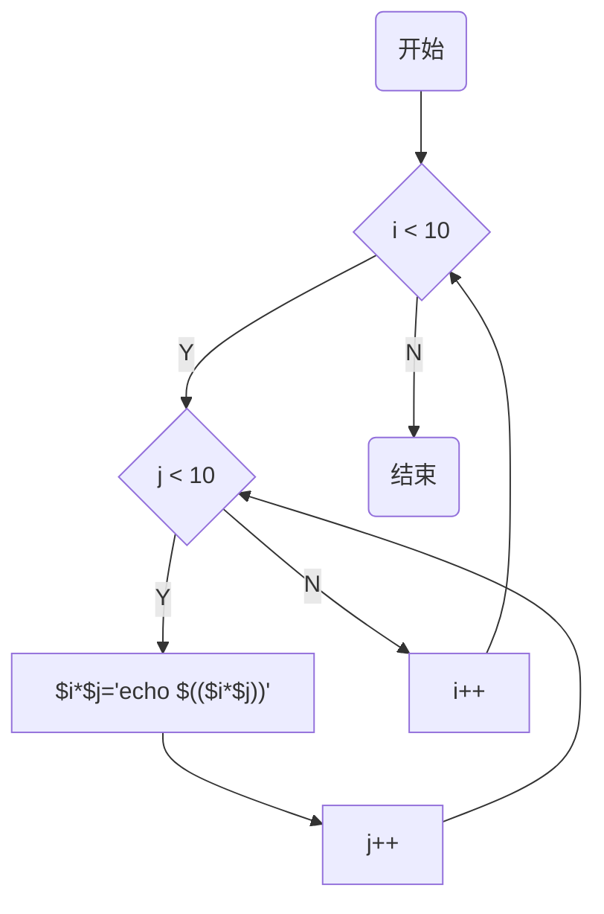
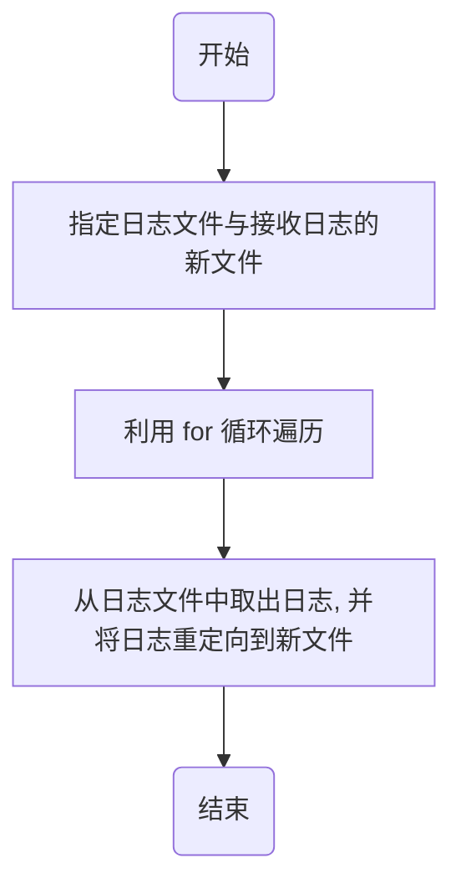
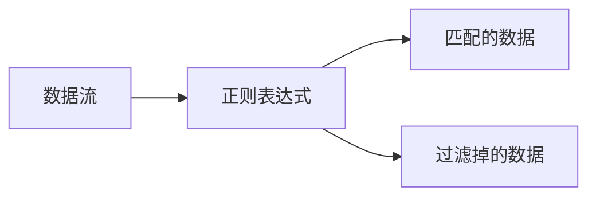

[toc]

# shell 编程基础

编写 shell 程序九九乘法表，了解 shell 的编程方法，熟悉 shell 中字符与运算符，掌握 shell 常用指令与 shell 变量，掌握 shell 流程控制语句。在任务实施过程中：

- 熟悉常用的指令与运算符；
- 熟悉 shell 中各种字符的用法；
- 掌握流程控制语句的用法；

Linux 操作系统运行时需要手动输入命令。为了使 linux 可以自动实现一些功能而开发了 shell 编程，使 Linux 可以通过编程与命令的结合实现自动化。在 Linux 命令行界面中要实现通过 shell 脚本自动录入 linux 命令的功能，先要了解 shell 编程基础。

通过对本项目的学习，在 root 账户下新建名为 programming.sh 的文本，利用 for 循环与 bash 命令最终实现乘法表。代码流程图如下所示：



## shell 介绍

### 1. 简介

是一个命令解释器，同时也是功能强大的编程语言。用 shell 的编程语言编写的脚本可以直接调用 linux 系统命令。

shell 位于操作系统的最外层，负责直接与用户对话。它解释由用户输入的命令并且把他们送到内核，经过处理后，将结果输出到屏幕返回给用户。shell 的这种对话方式可以是交互式也可以是非交互式。交互式是指从键盘输入的命令可以立即得到 shell 的回应；非交互式指 shell 脚本。

shell 为用户提供了一个可视化的命令行输入界面，以便向 linux 内核发送请求来运行程序。用户可以使用 shell 命令启动、挂起、停止和编写一些程序。shell 在操作系统的位置如图所示：


shell 拥有执行程序文件的权限。具有易编写、易调试、灵活性强的特点。

shell 的不同版本

| shell 版本   | 说明                                                         |
| ------------ | ------------------------------------------------------------ |
| bourne shell | 贝尔实验室开发                                               |
| bash         | 一个为 GNU 计划编写的 unix shell。bash 的全称是 bourne-again shell。bash 是大多数 linux 操作系统上默认的shell，也是 CentOS 7.4 的默认 shell |
| korn shell   | 对 bourne shell 的发展，大部分内容与 bourne shell 兼容       |
| c shell      | sun 公司 shell 的 bsd 版本                                   |
| z shell      | 集成了 bash 的重要特性，同时又增加了自己独有的特性           |


### 2. shell 脚本运行

运行 shell 脚本有两种方法：作为可执行程序和使用 bash 命令。

1. 可执行程序：将文本保存为后缀是 .sh 的文本文件，使用`ls -al`命令查看文本的权限，当文本文件本身没有可执行权限（即，文件属性 x 位为 - 号）时，使用 `cd`命令进入该文件所在的目录，通过改变文件权限使程序可以执行，格式如下：

   ```
   chmod o+x ./文件名 # 使脚本具有执行权限
   ./文件名 # 执行脚本 文件路径+文件名
   ```

   **注意**：要写成 `./文件名`，而不是直接写文件名。否则 linux 系统会在 path 里寻找有没有该文件。而 path 里通常只有 /bin， /sbin， /usr/bin， /usr/sbin 等目录。当前目录通常不在 path 里面，所以直接写文件名找不到命令，要用 `./文件名`告诉系统在当前目录找文件。

2. bash 命令：将文本保存为后缀是 .sh 的文本文件，使用`ls -al`命令查看文本的权限，当文本文件本身没有可执行权限（即，文件属性 x 位为 - 号）时，使用 `cd`命令进入该文件所在的目录，然后利用 `bash`命令运行该文件。bash 命令格式如下：
   `bash 文件名`

3. 第一个 shell 程序如示例代码所示：

   ```
   # vim 创建文件，输入以下内容
   echo hello world!
   ```

4. 例：

   ```
   vim hello.sh
   # 输入内容： echo hello world!
   ls -al hello.sh
   chmod o+x hello.sh
   ./hello.sh
   
   bash hello.sh
   ```

   

## shell 基础


### 1. shell 常用指令

shell 的常用指令有 echo 命令、printf 命令、test 命令、read 命令：

1. echo 命令：用于输出字符串。在 echo 命令中不能使用转义字符。命令格式如下：
   `echo [-n] string`
n 表示输出文字后不换行；
   
   `echo -e '\n'` 
   -e 开启转义
   
2. printf 命令：用于输出字符串。printf 命令由 POSIX 标准定义，因此使用 printf 命令的脚本比使用 echo 命令的脚本移植性好。并且，printf 命令中可以使用转义字符。命令格式如下：
   `printf format-string [arguments...]`
   其中，`format-string`为格式控制字符串；`arguments`为参数列表。
   格式控制字符串说明

   | 字符 | 说明                                                |
   | ---- | --------------------------------------------------- |
   | %d   | decimal 十进制整数，其对应位置参数必须是十进制整数  |
   | %s   | string 字符串，其对应位置参数必须是字符串或者字符型 |
   | %c   | char 字符，其对应位置参数必须是字符串或者字符型     |
   | %f   | float 浮点，其对应位置参数必须是浮点型数字          |

   printf 输出中的转义字符

   | 转义字符 | 说明                              |
   | -------- | --------------------------------- |
   | \a       | 警告字符，通常为ascii 的 bel 字符 |
   | \b       | 后退                              |
   | \f       | 换页                              |
   | \n       | 换行                              |
   | \r       | 回车                              |
   | \t       | 水平制表符                        |
   | \v       | 垂直制表符                        |
   | \\\\     | 反斜杠字符                        |

   例 1：printf 命令按照格式输出姓名、性别、属性、体重：

   ```
   vim printf.sh
   # 文件内容如下
   printf "%-10s %-8s %-10s %-4s\n" name sex attribute weight\(kg\)
   printf "%-10s %-8s %-10s %-4.2f\n" guojing man Adorkable 76.1234
   printf "%-10s %-8s %-10s %-4.2f\n" yangguo man handsom 72.6543
   printf "%-10s %-8s %-10s %-4.2f\n" guofu woman beauty 47.9876
   
   bash printf.sh
   ```

   

3. read 命令：用于从键盘读取变量的值。通常用于 shell 脚本与用户进行交互的场合。该命令可以一次读取多个变量的值，变量和输入的值都需要使用空格隔开。在 read 命令后面，如果没有指定变量名，读取的数据将被自动赋给特定的变量 **REPLY**。read 命令格式如下：
   `read [-ers] [-a aname] [-d delim] [-i text] [-n nchars] [-N nchars] [-p prompt] [-t timeout] [-u fd] [name ...]`

   read 命令常用选项

   | 选项 | 说明                                                         |
   | ---- | ------------------------------------------------------------ |
   | -p   | 后面跟提示信息，即在输入前打印信息                           |
   | -t   | 指定读取值时的等待时间                                       |
   | -a   | 后面跟一个变量，该变量会被认为是数组，然后给其赋值，默认是以空格作为分隔符 |
   | -d   | 后面跟一个标识符，作为结束的标志                             |
   | -e   | 在输入的时候可以使用命令补全                                 |
   | -n   | 后跟一个数字，定义输入文本的长度                             |
   | -r   | 屏蔽 \，如果没有该选项，则 \ 作为一个转义字符；如果有，就作为正常的字符 |
   | -s   | 安静模式，在输入字符时不在屏幕上显示，例如 login 时输入密码  |
   | -u   | 后面跟文件路径，从文件描述符中读取                           |

   例 2：从键盘读取姓名与年龄的值然后输出到姓名与年龄，接收键盘输入命令如下所示：

   ```
   echo please input your name: # 从键盘输入姓名
   read name # 读取姓名
   echo please input your age: # 键盘输入年龄
   read age # 读取年龄
   echo my name is $name, my age is $age # 使用读取的姓名与年龄
   ```

   

4. test 命令：shell 中的 test 命令用于检查某个条件是否成立。它可以进行数值、字符和文件三个方面的测试。在测试时需要用到条件测试符 []。“[” 与 test 等同，“[]” 结构中的左括号是调用 test 命令的标识，右括号用于关闭条件判断。这个命令把它的参数作为比较表达式，并且根据比较的结果返回一个退出状态。其中表达式要放在方括号之间，并且要有空格。例如 `[$a==$b]`是错误的，必须写成`[ $a==$b ]`。

   1. 数值测试：常用于两个数字的大小比较。常用的比较运算符如下：

      | 运算符 | 说明            |
      | ------ | --------------- |
      | -eq    | 等于为 true     |
      | -ne    | 不等于为 true   |
      | -gt    | 大于为 true     |
      | -ge    | 大于等于为 true |
      | -lt    | 小于为 true     |

      例 3：使用数值测试来比较数值大小：

      ```
      # numerical_test.sh
      
      if test $[10] -gt $[20]
      then
      	echo "10>20"
      else
      	echo "10<20"
      fi
      ```

      

   2. 字符串比较：用来检测字符串的长度或用于两组字符串的比较。常用的字符串比较运算符如下：

      | 运算符 | 说明                                     |
      | ------ | ---------------------------------------- |
      | =      | 检测两个字符串是否相等，相等返回 true    |
      | !=     | 检测两个字符串是否不等，不等返回 true    |
      | -z     | 检测字符串长度是否为 0，为 0 返回 true   |
      | -n     | 检测字符串长度是否为 0，不为 0 返回 true |
      | str    | 检测字符串是否为空，不为空返回 true      |

      例 4：使用字符串测试比较字符串 asd 与 jkl 是否相等。代码示例如下

      ```
      if [ asd = jkl ]
      then
      	echo equal
      else
      	echo unequal
      fi
      ```

      

   3. 文件测试：文件测试用于检测文件的各种属性。表中列出了常用的文件测试运算符，并以一个普通的不为空的文件 file 为例。
   文件测试运算符
      
      | 操作符  | 说明                                                         |
      | ------- | ------------------------------------------------------------ |
      | -b file | 检测文件是否是块设备文件，是则返回 true                      |
      | -c file | 检测文件是否是字符设备文件，是则返回 true                    |
      | -d file | 检测文件是否是目录，是则返回 true                            |
      | -f file | 检测文件是否是普通文件（既不是目录，也不是设备文件），是则返回 true |
      | -g file | 检测文件是否设置了 SGID 位，是则返回 true                    |
      | -k file | 检测文件是否设置了 粘着位（sticky bit），是则返回 true       |
      | -p file | 检测文件是否是有名管道，是则返回 true                        |
      | -u file | 检测文件是否设置了 SUID 位，是则返回 true                    |
      | -r file | 检测文件是否可读，是则返回 true                              |
      | -w file | 检测文件是否可写，是则返回 true                              |
      | -x file | 检测文件是否可执行，是则返回 true                            |
      | -s file | 检测文件是否为空（文件大小是否大于 0），不为空则返回 true    |
      | -e file | 检测文件（包括目录）是否存在，存在则返回 true                |
      
      例 5：输入文件的全路径查看文件是否存在：
      
      ```
      vim file_test.sh
      
      # 文件内容
      if test -e ./wen # 判断文件是否存在
      then
      	echo true #　存在是输出 true
      else
      	echo false # 不存在输出 false
      fi
      
      bash file_test.sh
      ```
      
      

### 2. 变量

变量名是用来存储某些非固定值的载体，它有一个值与 0 个或多个属性。

1. 定义变量：shell 定义变量的规则如下：

   - 变量名与等号之间不能存在空格；
   - 只能使用英文字母、数字和下划线 _ 命令，且首个字符不能以数字开头；
   - 在变量名中不能使用标点符号；
   - 不要使用关键字命名。

   例 1：定义变量如下所示：

   ```
   name= leeyy
   _age=15
   echo $name
   echo $_age
   ```

2. 变量类型：变量分为环境变量和普通变量（局部变量）。普通变量在脚本或命令中定义，仅在当前 shell 实例中有效。其他 shell 启动的程序不能访问普通变量（局部变量）。
   环境变量通常由系统自定义，必要的时候 shell 脚本也可以定义环境变量。环境变量可以被所有程序（包括 shell 启动的程序）访问。有些程序需要环境变量来保证其正常运行。常见的环境变量及其含义如下表所示：

   | 环境变量 | 含义                                    |
   | -------- | --------------------------------------- |
   | BASH     | bash shell 的全路径                     |
   | CDPATH   | 用于快速进入某个目录                    |
   | EUID     | 用于记录当前用户的 UID                  |
   | FUNCNAME | 用于记录当前函数体的函数名的文件        |
   | HISTCMD  | 用于记录下一条命令在 history 命令的编号 |
   | HISTFILE | 用于记录 history 命令的文件             |
   | PATH     | 命令的搜索路径                          |
   | LANG     | 设置当前系统的语言环境                  |

3. 声明变量：declare 命令用于声明 shell 变量并设置变量的属性。常用格式如下：
   `declare [选项] [变量名称=设置值]`
   declare 命令选项

   | 选项 | 说明                                           |
   | ---- | ---------------------------------------------- |
   | +/-  | - 用来指定变量的属性；+ 取消变量所设置的属性。 |
   | -i   | 声明为整数                                     |
   | -a   | 声明为数组                                     |
   | -f   | 声明为函数                                     |
   | -F   | 仅打印函数名字                                 |
   | -r   | 声明为只读                                     |
   | -x   | 自定义环境变量                                 |

   例 2：使用 declare 命令声明变量类型

   ```
   declare -i age=13
   echo $age
   
   declare -i name=leeyy # 错误的变量赋值格式，结果输出为 0 
   echo $name
   ```

   

4. 使用变量：使用一个定义过的变量，只要在变量名前加 $ 即可。变量名外面的大括号｛｝是为了帮助解释器识别变量的边界。除了帮助解释器识别变量的边界外，｛｝还可以用作扩展变量，如下所示：
   扩展变量

   | 表达式                      | 作用                                                   |
   | --------------------------- | ------------------------------------------------------ |
   | ${VAR}                      | 取变量 VAR 的值                                        |
   | ${VAR:-DEFAULT}             | 如果变量没有定义，则以 $DEFAULT 作为其值               |
   | ${VAR:=DEFAULT}             | 如果变量没有定义，或者值为空，则以 $DEFAULT 作为其值   |
   | ${VAR+VALUE}                | 如果定义了 VAR，则值为 $VALUE，否则为空字符串          |
   | ${VAR:+VALUE}               | 如果定义了 VAR 且不为空，则值为 $VALUE，否则为空字符串 |
   | ${VAR?MSG}                  | 如果 VAR 没有被定义，则打印 $MSG                       |
   | ${VAR:?MSG}                 | 如果 VAR 没有被定义或未赋值，则打印 $MSG               |
   | \${!PREFIX*} 或 ${!PREFIX@} | 匹配所有以 PREFIX 开头的变量                           |
   | ${#STR}                     | 返回 $STR 的长度                                       |
   | ${STR:POSITION}             | 从位置 $POSITION 处提取子串                            |
   | ${STR:POSITION:LENGTH}      | 从位置 $POSITION 处提取长度为 \$LENGTH 子串            |
   | ${#STR# SUBSTR}             | 从变量 $STR 的开头处寻找，删除最短匹配的 \$SUBSTR 子串 |
   | ${#STR## SUBSTR}            | 从变量 $STR 的开头处寻找，删除最长匹配的 \$SUBSTR 子串 |
   | ${#STR% SUBSTR}             | 从变量 $STR 的结尾处寻找，删除最短匹配的 \$SUBSTR 子串 |
   | ${#STR%% SUBSTR}            | 从变量 $STR 的结尾处寻找，删除最长匹配的 \$SUBSTR 子串 |
   | ${#STR/ SUBSTR /REPLACE}    | 使用 \$REPLACE 替换第一个匹配的 $ SUBSTR               |
   | ${#STR// SUBSTR /REPLACE}   | 使用 \$REPLACE 替换所有匹配的 $ SUBSTR                 |
   | ${#STR/# SUBSTR /REPLACE}   |                                                        |
   | ${#STR/% SUBSTR /REPLACE}   |                                                        |

   

5. 重赋值变量：已经赋值的变量可以重新给他赋值。

6. 只读变量：除了使用 declare -r 以外，还可以使用 readonly 命令将变量定义为只读变量。只读变量的值不能被改变。

7. 删除变量：使用 unset 命令删除变量。

   ```
   vim unset.sh
   
   name=leeyy
   echo ${name}
   unset name
   echo ${name}
   ```

   

### 3. 运算符

shell 支持多种运算符：算数运算符、布尔运算符、逻辑运算符、字符运算符、文件测试运算符。

1. 算术运算符：原生 bash 不支持简单的数学运算，但是可以使用 let 命令或`(())`进行基本的整数运算。let 命令是 bash 中用于计算的工具，童工常用的运算符。当计算不加 $ 时，如果表达式的值是非 0，那么返回的状态是 0；否则返回的状态是 1。格式如下：
   `let 算数表达式`

   `(())`符号可用于简单的计算。当计算不加 $ 时，如果表达式的结果为 0，返回的状态是 1 或 false；否则，返回的状态值是 0 或 true。格式如下：
   `((算数表达式))`
   常用的整数算数运算符如下

   | 运算符 | 说明 |
   | ------ | ---- |
   | +      | 加   |
   | -      | 减   |
   | *      | 乘   |
   | /      | 除   |
   | %      | 取余 |
   | =      | 赋值 |
   | ==     | 相等 |
   | !=     | 不等 |
   | +=     | 加等 |
   | -=     | 减等 |
   | *=     | 乘等 |
   | /=     | 除等 |
   | %=     | 余等 |
   | ++     | 自增 |
   | --     | 自减 |

   自增运算中，以`((a++))`为例，先为 a 赋值后自增 1；`((++a))`是先增加 1 后再赋值。自减运算同理。

   除整数运算外还有浮点运算。浮点运算使用 bc 命令实现。默认不输出小数点后面的值。小数位数由变量 `scale`控制（保留小数按照去尾法，不是四舍五入）。示例代码如下：

   ```
   i=1.2
   j=10
   echo "scale=0; $j/$i" |bc
   echo "scale=2; $j/$i" |bc
   echo "scale=10; $j/$i" |bc
   ```
   
   
   
   
   
2. 位运算符：常用的位运算符有按位与（&）、按位或（|）、按位取反（~）、按位异或（^）、左移（<<）、右移（>>）。位运算符在计算时是面向二进制数字而言的，下面是位运算符的运算方法。

   1. 按位与（&）中，按位比较二进制数，上下均为 1 则取 1，否则取 0：

      |              | 1    | 0    | 0    |      |
      | ------------ | ---- | ---- | ---- | ---- |
      |              | 0    | 1    | 0    | 0    |
      | 比较结果为 0 | 0    | 0    | 0    | 0    |

   2. 按位或（|）中，按位比较二进制数，上有一个为 1 则取 1，否则取 0：

      | 8 的二进制数  | 1    | 0    | 0    | 0    |
      | ------------- | ---- | ---- | ---- | ---- |
      | 4的二进制数   | 0    | 1    | 0    | 0    |
      | 比较结果为 12 | 1    | 1    | 0    | 0    |

   3. 按位取反（~）中，按位取与自身相反的数：

      | 4的二进制数                        | 0    | 1    | 0    | 0    |
      | ---------------------------------- | ---- | ---- | ---- | ---- |
      | 取反结果（注意负数的二进制表示法） | 1    | 0    | 1    | 1    |

   ---

   **关于数在计算机中的二进制存储**

   1. 二进制数在内存中以补码形式存储。
   2. 原码表示法，在数值前面增加了一位符号位（即最高位为符号位）。正数的符号位为 0，负数的符号位为 1，0 有两种表示（`00000000`和 `10000000`）。例如，用 8 位二进制数表示，11 的原码为`00001011`，-11 的原码为`10001011`。
   3. 反码：正数的反码与原码相同；负数的反码是对其原码按位取反，符号位除外。0 的反码有两种：`00000000`和`11111111`。
   4. 补码：正数的补码与原码相同；负数的补码是在其反码末位加 1。（求负整数的补码，原码符号位不变，先将原码减去 1，最后数值各位取反。但由于二进制的特殊性，通常先使数值位各位取反，最后整个数加 1。）0 的补码只有一个：`00000000`。
   5. 进行补码运算时，应注意所得结果不应超过补码所能表示数的范围。
   6. 已知补码求原码的操作：对该补码再求补码。
      1. 如果补码的符号位是 0，表示是一个正数，其原码和补码相同；
      2. 如果补码的符号位是 1，表示是一个负数，那么求给定的这个补码的补码就是原码。

   

   ---

   1. 按位异或（^）中，按位比较二进制数，上下相同取 0，上下不同取 1：

      | 8 的二进制数 | 1    | 0    | 0    | 1    |
      | ------------ | ---- | ---- | ---- | ---- |
      | 4的二进制数  | 0    | 1    | 0    | 1    |
      | 比较结果为 0 | 1    | 1    | 0    | 0    |

   2. 左移运算（<<）：是将二进制数整体左移指定位数，左移之后的空位用 0 补充：

      | 左移前     | 0    | 0    | 1    | 0    | 0    |
      | ---------- | ---- | ---- | ---- | ---- | ---- |
      | 左移两位后 | 1    | 0    | 0    | 0    | 0    |

   3. 右移运算（>>）：是将二进制数整体右移指定位数，右移之后的空位用 0 补充：

      | 右移前     | 1    | 0    | 0    | 0    |
      | ---------- | ---- | ---- | ---- | ---- |
      | 右移两位后 | 0    | 0    | 1    | 0    |

3. 布尔运算符：布尔运算的结果只有 true 和 false 两种情况。
   常用的布尔运算

   | 运算符 | 说明                                                         |
   | ------ | ------------------------------------------------------------ |
   | !      | 非运算，表达式为 true 则返回 false；表达式为 false 则 返回 true |
   | -o     | 或运算，有一个表达式为 true，则返回 true                     |
   | -a     | 与运算，两个表达式都为 true 才返回 true                      |

   例：使用布尔运算符判断变量是否符合规定：

   ```
   a=10
   b=20
   
   if [$a != $b] # 判断 a 与 b 的值是否不等
   then 
   	echo true
   else
   	echo false
   fi
   
   if [$a -lt 20 -a $b -gt 0] # 判断 a<20 与 b>0 是否都满足条件
   then
   	echo true
   else
   	echo false
   fi
   ```

   

4. 逻辑运算符：逻辑运算符的结果也只有 true 和 false 两种情况。表中列出了常用的逻辑运算符：

   | 运算符 | 说明                                         |
   | ------ | -------------------------------------------- |
   | &&     | 当符号两边都为 true 时，返回 true （与）     |
   | \|\|   | 当符号两边有一个为 true 时，返回 true （或） |
   | !      | 逻辑非，对真假取反                           |

   例：

   ```
   a=10
   b=20
   
   if [ $a\<0 ] || [$b\>0]
   then
   	echo true
   else
   	echo false
   fi
   ```

   

### 4. 字符

1. 通配符：指的是该字符可以匹配任意字符，常用于模式匹配，在查询、修改等操作的时候非常好用。常见的通配符有 \* ? 和 [ ] 括起来的字符序列。具体操作如下表所示：

   | 字符 | 作用                                                         |
   | ---- | ------------------------------------------------------------ |
   | \*   | 代表任意长度的字符串，但不包括点号和斜线。如`a*`表示以 a 开头的任意长度的字符串 |
   | ?    | 可用于匹配任意一个单个字符                                   |
   | [ ]  | 代表匹配其中任意一个字符。[a-c] 等同与 [abc]，代表匹配 a 或 b 或 c |

   

2. 引用：引用是指将字符串用特定符号括起来，以防止特殊字符被解释成其他意思。shell 中共有四种引用符，分别是双引号（""）、单引号（''）、反引号（``）和转义符号（\）。除了 \$（美元符号）、\（反斜杠）、''（单引号）、和 ""（双引号）这几个符号保留其特殊功能外，其余字符仍作为普通字符对待。

   > 单引号括起来的字符都作为普通字符出现；
   >
   > 反引号会将括起来的内容解释为系统命令；
   >
   > 转义字符会将具有特殊意义的字符解释为普通字符。

3. 其他常用字符：

   1. 注释：shell 使用 # 作为注释符，注释范围是所在行。但是脚本中的 `#!`后跟某个解释器的路径，例如`#! /bin/bash`不是注释的意思；

   2. 管道`|`：管道是 linux 的一种频繁使用的通信机制。能够将一个命令的输出内容当作下一个命令的输入内容。只需要将两个命令用管道符连接起来。

      例：用 `ls -l`查看某个文件的内容，再将内容用 `more`命令逐页显示出来，代码如下：
      `ls -l /etc/init.d | more`

   3. 重定向：将原本由标准输入设备输入的内容改由其他文件或设备输入；将原文应该输出到标准输出设备的内容输出到其他文件或设备上。重定向符号如下表所示：

      | 符号 | 功能               |
      | ---- | ------------------ |
      | >    | 标准输出覆盖重定向 |
      | >>   | 标准输出追加重定向 |
      | >&   | 标识输出重定向     |
      | <    | 标准输入重定向     |

      例：将 `ls -l`输出到终端的目录信息输入到文件 dir.txt
      `ls -l > dir.txt`


## shell 流程控制语句


### 1. 条件控制语句

if 语句，case 语句。if 语句

1. if 语句：

   1. if/else 语句：格式如下：

      ```shell
      if 条件
      then
      语句 1
      else
      语句 2
      fi
      ```

      条件是值为 true 或 false 的表达式，可以是命令、函数、或 test 语句。执行流程如下所示：

      ```mermaid
      graph TD
      a(开始) --> b{条件}
      b --Y--> c[语句 1]
      b --N--> d[语句 2]
      c --> e(结束)
      d --> e(结束)
      ```

      例 1：使用 if 语句判断输入的年龄是否大于 20：

      ```
      echo "please input your age"
      read age
      
      if [ $age -gt 20 ]
      then
      	echo "Age is more than 20."
      else
      	echo "Age is less than 20."
      fi
      ```

      

   2. if/elif/else 语句：格式如下

      ```shell
      if 条件 1
      then
      	语句 1
      elif 条件 2
      then
      	语句 2
      else
      	语句 3
      fi
      ```

      **由于 shell 脚本没有花括号`{}`，所以用`fi`表示语句块的结束**

      条件是值为 true 或 false 的表达式。执行过程如下所示：

      ```mermaid
      graph TD
      a(开始) --> b{条件 1}
      b --Y--> c[语句 1]
      b --N--> d[条件 2]
      d --Y--> e[语句 2]
      d --N--> f[语句 3]
      c --> g(结束)
      e --> g
      f --> g
      ```

      在使用 if-elif-else 分支进行数值判断时，如果使用 test 指令进行判断，当第一条 if 条件为假时，无论代码中的 elif 语句条件是否为真，都输出 elif 分支下的语句。为了得到预期结果，可以采用双圆括号进行判断。【好像没有发现什么问题，自己测试是都可以的】示例代码如下：
      例 2：比较变量 var1 和变量 var3 的大小。

      ```
      var1=20
      var3=20
      
      if [ $var1 -gt $var3 ]; then
      	echo "var1 > var3"
      elif [$var1 -lt $var3]; then
      	echo "var1 < var 3"
      else
      	echo "var1 = var3"
      ```

      ```
      if (($var1 > $var3)); then
      	echo "var 1 > var 3"
      elif (($var1 < $var3)); then
      	echo "var 1 < var 3"
      else
      	echo "var 1 = var 3"
      fi
      ```

      综上，if 语句具有如下特点：

      - 如果两个命令卸载同一行需要用`;`隔开。一行只写一条命令不需要写`;`。`then`后面有换行，但这条命令没有写完，shell 会自动续接，把下一行接在 then 后面当作一条命令处理。
      - 注意命令和各参数之间必须使用空格隔开。
      - if 命令条件的值为真，则执行 then 后面的语句；if 命令条件的值为假，则执行 elif、else 后面的语句。
      - if 后面的条件通常通常是值为 true 或 false 的表达式。

   3. case 语句：case 语句适用于需要进行多重分支的情况。格式如下：

      ```
      case $变量 in
      1) 语句 1
      ;;
      2) 语句 2
      ;;
      3) 语句 3
      *) 默认执行的语句
      ;;
      esac
      ```

      case 语句的执行过程：当传入变量值与下面的顺序值对应时，执行该值下的语句；当传入的变量值与下面的顺序值不对应时，执行`、*`下的默认语句。case 语句执行过程如图所示：

      ```mermaid
      graph TD
      a(开始) --> b{p==1}
      b --Y--> c[语句 1]
      b --N--> d{p==2}
      d --Y--> e[语句 2]
      d --N--> f{p==n}
      f --Y--> g[语句 3]
      f --N--> h[默认语句]
      c --> i(结束)
      e --> i(结束)
      g --> i(结束)
      h --> i(结束)
      ```

      case 语句的结构特点如下：

      - case 行结尾必须为单词 in，每一个模式必须以右括号`)`结束；
      - 双分号`;;`表示命令序列的结束；
      - 匹配模式中可以使用方括号表示一个连续的范围，如 [0-9]；使用`|`表示或；
      - 最后的`*)`表示默认模式，当使用前面的各种模式均无法匹配该变量时，将执行`*)`后的命令序列；

      例：由用户键盘输入一个字符，判断该字符是否为字母、数字或其他字符。

      ```
      read -p "press any key, then press return: " key
      
      case $key in
      [a-z]|[A-Z])
      echo "it's a letter."
      ;;
      [0-9])
      echo "it's a digit."
      ;;
      *)
      echo "it's function keys, spacebar or other keys."
      esac
      ```


### 2. 循环语句

常用的循环有 for、while、until、select 循环与嵌套循环。循环常用于需要反复执行某语句。

1. for 循环：有两种格式。

   ```
   # 格式 1
   for var in item1 item2 ... itemN
   do
   	循环体
   done
   ```

   在格式 1 中，当变量值在列表中时，for 循环在执行完从语句 1 到语句 N 后，可以使用变量获取当前值。in 列表时可选的，包含命令替换、字符串和文件名。如果不用 lin 列表，for 循环使用命令行的位置参数。**这个语句和 python 的 for 语句有点像**

   ```
   # 格式 2
   for ((初始化部分:循环条件:迭代部分))
   do
   	循环体
   done
   ```

   在格式 2 中，执行 for 循环时，初始化部分首先被执行，并且只执行一次。接下来执行作为循环条件的表达式，如果结果为 true，就执行循环体，接着执行迭代部分。然后再计算作为循环条件的表达式。直到不满足循环条件退出循环。**这个 for 语句又和 c 语言有点像**

   for 循环的流程图如下所示：

   ```mermaid
   graph TD
   a(开始) --> b{条件}
   b --Y--> c[循环体]
   b --N--> d(结束)
   c --> b
   ```

   例 2：顺序输出当前列表中的数

   ```shell
   # 格式1
   for loop in [1-10]
   do 
   echo "The value is: $loop."
   done
   
   # 格式2
   for((loop=0;loop<20;loop++))
   do 
   echo "The value is: $loop."
   done
   ```

2. while 循环：while 循环用于不断执行一系列命令，也用于从输入文件中读取数据；命令通常为测试条件。格式如下：

   ```shell
   while 条件
   do
   	循环体
   done
   ```

   流程图如下所示：

   ```mermaid
   graph TD
   a(开始) --> b{条件}
   b --Y--> c[循环体]
   b --N--> d(结束)
   c --> b
   ```

   例 3：示例代码

   ```shell
   int=1
   
   while (( $int<=5 ))
   do
    echo $int
    let "int++"
   done
   ```

   while 循环用于无限循环。无限循环的语法格式如下：

   ```shell
   while :
   do
   	循环体
   done
   ```

   ```shell
   while true
   do
   	循环体
   done
   ```

3. until 循环：until 循环执行一系列命令直到条件为 true 为止。until 循环与 while 循环在处理方式上刚好相反。只在极少数情况下 until 循环比 while 循环更加好用。until 语法格式如下：

   ```
   until 条件
   do
   	语句
   done
   ```

   until 后面的条件一般为条件表达式，如果返回值为 false，则继续执行循环体内的语句，否则跳出循环。

   例 3：使用 until 命令输出 0-9 的数字。

   ```shell
   a=0 # 初始化变量
   
   until [ ! $a -lt 10 ]
   do
   	echo "The $a times loop."
   	let 'a++'
   done
   ```

   

4. select 循环：select 是一种菜单扩展方式。其语法和带列表的 for 循环非常类似，结构如下：

   ```shell
   select MENU in (list)
   do
   	语法
   done
   ```

   例：从红、黑、黄、绿中选择最喜欢的颜色。代码示例如下：

   ```shell
   echo 'What is your favorite color?'
   select var in "red" "black" "yellow" "blue"; do # 循环输出列举的颜色
   break; # 如果没有 break，则会无限进行下去。键盘输入 ctrl + D 也可以终止
   done
   echo "You have selected $var"
   ```

   

5. 嵌套循环：即，一个循环中的循环体是另外一个循环。for、while、until、select 语句都可以使用嵌套循环。在嵌套循环中可以使用多重嵌套。但是过度的嵌套会让程序变得晦涩难懂，所以除了必要的情况。不建议使用三层以上的嵌套。嵌套循环的代码如下所示：

   ```shell
   for loop1 in 1 2 3
   do 
   for loop2 in 4 5
   do
   echo "The outer loop is $loop1."
   echo "The inner loop is $loop2."
   echo "The product is $(($loop1*$loop2))."
   done
   done
   ```

   

### 3. 循环控制语句

break 语句和 continue 语句，常用于终止循环。

1. break 语句：用于终止整个循环，格式如下：

   `break n`

   在嵌套循环中，`break n`表示跳出第 n 层循环。当 n 为 1 时，可以只写 `break`命令。示例代码如下：

   ```
   a=0
   
   while [ $a -lt 10 ]
   do
   echo $a
   if [ $a -eq 5 ]
   then
   break
   fi
   
   a=`expr $a + 1` # 这里用的是反引号，即将这个命令解释为系统命令
   done
   ```

   

2. continue 语句：不会跳出所有循环，只跳出当前循环。格式如下
   `continue n`n 表示跳出第 n 层循环。当 n 为 1 时只写 continue 命令。

   例 2：

   ```shell
   while :
   do 
   	echo -n "Input a number between 1 to 5 (q for quit):"
   	read aNum
   	case $aNum in # 选择输入的数字
   	1|2|3|4|5) echo "Your number is $aNum."
   	;;
   	q) break
   	;;
   	*) echo "You did not select a number between 1 to 5."
   	continue
   	echo "Game is over."
   	;;
   	esca
   done
   ```

   

## 任务 7：用 shell 输出九九乘法表


创建文件 programming.sh 的文件输出乘法表

```shell
  1 i=1 # row number
  2 j=1 # colume number
  3 
  4 for i in $(seq 1 9)
  5 do
  6     for j in $(seq 1 $i)
  7     do
  8         echo -n "$j*$i = $(($j*$j)) "
  9     done
 10     echo ''
 11 done

```

### 输出边长为 5 个`*`的三角形的形状

```shell
  1 for i in $(seq 0 4)
  2 do
  3 
  4     for ((k=4;k>=j;k--))
  5     do
  6         echo -n ' '
  7     done
  8 
  9     for ((j=0;j<=i;j++))
 10     do
 11         echo -n '* '
 12     done
 13     echo ''
 14 done

```


  

# shell 编程高级

通过使用 shell 脚本操作日志，了解数组、函数、正则表达式的概念，熟悉正则表达式中符号的含义及常用场景，掌握数组的常用操作与函数的使用，掌握任务的管理。在任务实施过程中：

- 熟悉数组的相关操作；
- 掌握函数的调用；
- 掌握任务的管理。

一些大型的使用 linux 系统的服务器每天都会产生大量的日志文件。当查看某部分日志文件时需要花费很多时间来查找该部分日志。linux 系统的 shell 高级编程可以实现**自动从日志文件中提取所需日志到新的文件**，方便查看日志内容。本次任务通过对 shell 高级编程的讲解，最终完成提取日志的功能。

### 任务目标

新建一个 automation.sh 的可执行文本，实现将 /var/log/messages 中的日志文件重定向到 may_09.log 文件中。流程图如下所示：




## 数组

### 1. 定义数组：

数组是能够存储多个值的变量。数组的值可以被单独引用，也可以用变量名来引用整个数组。如果要给某个变量设置多个值，可以把值放在括号内。格式如下所示：
`变量名=(value1 value2 value3 ...)`
注意，值与值之间需要用空格分隔开；

为变量设置多个值，如下所示：

```
array=(1 3 5 7 8 "abc" 'def')
echo ${array[*]}
```

第二种，用 declare -a 命令来定义数组：

```
declare -a array=(1 2 6 8)
echo ${array[*]}
```

综上所述，shell 中数组分为两种数据类型：数值型和字符串型。

- 数值类型的数组：可以直接用数字为数组赋值；
- 字符串类型数组：数组中的元素使用双引号或者单引号包含，引号之间也需要使用空格隔开。

### 2. 数组操作：

1. 数组赋值：为数组指定下标赋值。如果指定的下标已经超出当前数组的大小，新赋的值会被追加到数组的尾部，即数组会扩容，扩容不依赖于赋值时的下标，依赖于数组原来的实际长度；如果被赋值的下标已经存在，那么在该下标的新值会替代原来的旧值。为数组赋值的格式如下：
   `数组名 [下标]=值`

   代码示例如下：

   ```shell
   array=(1 3 5 7 9)
   echo ${array[0]}
   echo ${array[*]}
   
   array[3]=10
   array[10]=100
   echo ${array[*]}
   ```

   

2. 调用数组元素：通过下标来调用，下标值要用方括号`[]`括起来。如果要显示所有数组所有元素的值，用通配符`*`作为下标。
   `${数组名[下标]}`

3. 删除数组：用`unset`命令删除数组中的某个值：
   `uset 数组名[下标]`

4. 获取数组长度：使用如下格式获取数组长度：
   `变量名=${#数组名[*]}` 或 
   `变量名=${#数组名[@]}`

   示例代码如下：

   ```shell
   array01=(1 3 5 7 9)
   echo ${array01[*]}
   array_length01=${#array01[*]}
   array_length02=${#array01[@]}
   echo $array_length01
   echo $array_length02
   ```

   

5. 分片访问：访问从指定下标开始到指定下标结束的值。格式如下：
   `${数组名[@或*]:开始下标:结束下标}`

   当格式为`${数组名[下标]:m:n}`时，代表取数组中该下标对应的元素，从元素的第 n 个值开始截取 m 个值。在截取时将元素 `数组名[n]`从 0 开始计数。分片访问的示例代码如下所示：

   ```shell
   array=(1 3 5 7 9 'asdf')
   echo ${array[*]}
   echo ${array[*]:1:4}
   echo ${array[5]:2:3}
   ```

   

6. 模式替换：把数组中的旧值替换为新值，格式如下：
   `${数组名[@或*]/旧值/新值}`
   例 1：

   ```shell
   array=(1 3 5 7 9 'asdf')
   echo ${array[*]}
   array01=${array[@]/3/7}
   echo ${array01[@]}
   ```

   

7. 遍历数组：使用循环遍历。

   ```shell
   array=(1 3 5 7 9 "asdf")
   for v in ${array[*]}
   do
   	echo $v
   done
   ```

   

## 函数

### 1. 简介

shell 脚本可以作为一种编程语言来使用。大部分的编程语言都有函数。但是，由于 shell 是一个解释器，所以它不能对程序进行编译。而是在**从磁盘加载程序时对程序进行解释**。而程序的加载和解释都是非常耗时的。为了解决这个问题，许多 shell 都包含了函数。shell 把这些函数放在内存中，这样每次执行函数时就不必再从磁盘读入。shell 以一种内部格式来存放这些函数，这样就不必耗费大量的时间来解释函数。

虽然在 shell 中函数并不是必需的编程元素，但通过使用函数，可以更好地组织程序。将一些相对独立的代码变成函数，可以提高程序的可读性和重用性，避免重复写大量的代码。

linux shell 定义的函数在 shell 脚本中可以实时调用。shell 中函数的定义格式有两种。

格式一：

```shell
函数名 ()
{
	action
	[return int]
}
```

格式二：

```shell
function 函数名{
	action
	[return int]
}
```

在 shell 函数中可以使用 `function + 函数名()`来定义函数，也可以直接通过`函数名()`定义函数。在 shell 脚本中，`()`里面不加参数。`return`后面可加函数的返回值，有返回值时其格式为`return 返回值`；无返回值时以函数中最后一条命令的运行结果作为返回值。return 后跟的返回值的范围是 0-255 的整数。若返回值大于 255 则求其除以256的余数。

### 2. 无参函数

无参函数可以直接调用实现某功能。在调用无参函数时可直接写函数名，后面不加参数。根据是否有返回值将无参函数分为不带 return 与带 return 的两种情况。

1.  无返回值的函数：代码示例如下：

   ```shell
   first(){
   	echo "The first shell function."
   	echo "hello world!"
   	echo "hellow leeyy scoty."
   }
   
   echo "-----Function begins to execute-----"
   first
   echo "-----FUnction execution-------------"
   ```

   由示例代码可知，函数编写在脚本中，与其他命令一起存储。

   > 函数必须定义在脚本的最开始部分，然后在定义好的函数之后调用函数，或者在其他脚本中引用这些定义好的函数。

   > 调用了函数的脚本的执行过程：自上而下执行，但当遇到函数时，会先加载函数，当当函数被调用时才会被执行。

   

   函数名必须是唯一的。如果对函数进行了重定义，新定义的函数会覆盖原来的函数。重定义函数如下面的示例代码所示：

   ```shell
   func(){
   	echo "The first defination!"
   }
   
   func(){
   	echo "The re-defination."
   }
   ```

2. 有返回值的函数：有返回值的函数有 return 语句，且函数返回值小于 255。

   例：定义一个函数，实现先后输入的两个数相加的功能。

   ```shell
   adding(){
   	echo "This function adds two numbers to the input."
   	echo -n "Enter the first number: "
   	read numa
   	echo -e "\nEnter the second number: "
   	read numb
   	echo "The two numbers are $numa and $numb."
   	return $(($numa + $numb))
   }
   adding
   echo "The sum of the two number is $?."
   ```

   函数返回值在调用函数后通过`$?`来获得。

   当 return 返回值大于 255 时，在一个函数中定义两个数使它们相加之和大于 255。

### 3. 有参函数

在调用函数时向函数传递参数。在函数体内部，通过`$n`的形式来获取参数的值（当 n $\ge$ 10 时，需要使用`${n}`来获取参数），其中 n 表示第几个参数，例如 \$1 表示第一个参数；\$2 表示第二个参数……

例 1：在调用函数时为函数传入参数，在函数中输入指定参数的值，并验证当  n $\ge$ 10 时需要使用`${n}`来获取参数。

```shell
funcwithpara(){
	#echo "The zeorth number is $0."
	# 上一句命令不能执行
	echo "The first number is $1."
	echo "The second number is $2."
	echo "The third number is $3."
	echo "The fourth number is $4."
	echo "The fifth number is $5."
	echo "The sixth number is $6."
	echo "The seventh number is $7."
	echo "The eighth number is $8."
	echo "The nineth number is $9."
}

funcwithpara 0 1 2 3 4 5 6 7 8 9
```

可以用如下表所示的字符组合处理参数。

| 字符组合 | 说明                                                         |
| -------- | ------------------------------------------------------------ |
| $#       | 传递到脚本的参数个数                                         |
| $*       | 以一个单字符串显示所有向脚本传递的参数                       |
| $$       | 脚本运行的当前进程 ID 号                                     |
| $!       | 后台运行的最后一个进程的 ID 号                               |
| $@       | 与 $* 相同，但是使用时加引号，并在引号中返回每个参数         |
| $-       | 显示 shell 使用的当前选项，与 set 命令相同                   |
| $?       | 显示最后命令的退出状态。0 表示没有错误，其他任何值都表示有错误 |

 ```shell
funcwithpara(){
	echo "The first number is $1."
	echo "The second number is $2."
	echo "The third number is $3."
	echo "The fourth number is $4."
	echo "The fifth number is $5."
	echo "The sixth number is $6."
	echo "The seventh number is $7."
	echo "The eighth number is $8."
	echo "The nineth number is $9."
	echo "The tenth number is ${10}."
	echo "The eleventh number is $(11)."
	echo "The number of parameters is $#."
	echo "The parameters are $*."
	echo "The parameters are '$@'."
	echo "The process ID at present is $$."
	echo "The last process ID at backend is $!."
	echo "The current shell option is $-."
	echo "The exit condition of last command is $?."
}

funcwithpara 0 1 2 3 4 5 6 7 8 9 125
 ```


### 4. 函数与数组

1. 向函数传递数组参数：在向脚本函数传递数组变量时，如果将数组变量当作单个参数传递的话，函数只会取数组变量的第一个值。需要将该数组变量的值分解成单个的值，才可以作为函数参数起作用。例如：

   ```shell
   funarr(){
   	echo "The parameters are $*."
   	var1=$1
   	echo "The received values are ${var1[*]}."
   }
   
   myarray=(1 2 3 4 5)
   echo "The orginal array is: ${myarray[*]}."
   funarr $myarray # 将数组传入函数，不可行
   ```

   在函数内部，可以将所有的参数重新组合成一个新的变量。代码示例如下所示：

   ```shell
   funarr02(){
   	local newarray
   	newarray=("$@")
   	echo "The new array values are: ${newarray[*]}." # 利用函数输出数组元素
   }
   
   myarray=(1 2 3 4 5)
   echo "The orginal array is ${myarray[*]}."
   funarr02 ${myarray[*]} # 将数组传入函数 可行
   ```

   该脚本用 \$myarray 来保存所有的数组元素，然后将他们都放在函数的命令行上。函数随后从命令行中重建数组变量。在函数内部，重建的数组仍然可以像其他数组一样使用。代码示例如下所示：
   例：在函数内部使用数组:

   ```shell
   function addarray(){
   	local sum=0
   	local newarray
   	newarray=($(echo "$@")) # 将传入的数数组元素赋值到新数组中
   	for value in ${newarray[*]} # 遍历数组
   	do
   		sum=$[ $sum+$value ]
   	done
   	echo $sum
   }
   
   myarray=(1 2 3 4 5 6)
   echo "The orginal array is: ${myarray[*]}." # 输出原始数组
   arg1=$(echo ${myarray[*]})
   result=$(addarray $arg1)
   echo "The result is $result."
   ```

   

2. 从函数返回数组：函数用 echo 语句来按顺序输出单个数组的值，然后脚本再将它们重新放进一个新的数组变量中。代码示例如下
   例 2：

   ```shell
   arrayfun01(){
   	origarray=("$@")
   	newarray=("$@") # 生成副本
   	elements=$[ $#-1 ] # 传递到脚本的参数个数
   	for ((i=0;i<=$elements;i++))
   	do
   		newarray[$i]=$[ ${origarry[$i]}*2 ]
   	done
   	echo ${newarray[*]} # 输出新数组
   }
   
   myarray=(1 2 3 4 5 6 7 8 8 19)
   echo "The orginal array is: ${myarray[*]}."
   arg1=$(echo ${myarray[*]}) # 将数组的元素赋值给 arg1，这一句不太好理解
   result=($(arrayfun01 $arg1))
   echo "The new array is: ${result[*]}."
   ```

   该脚本用`$grg1`变量将数组的值传给 arrayfun01 函数。arrayfun01 函数将该数组重组到新的数组变量中，生成该输入数组变量的一个副本。然后对数组元素进行遍历，将每个元素值翻倍，并将结果存入该数组变量的副本。arrayfun01 函数使用`echo`语句来输出每个数组元素的值。脚本用 arrayfun01 函数的输出来重新生成一个新的数组变量。

### 5. 函数库

使用函数可以在脚本中省去一些输入工作。但当遇到要在多个脚本中使用同一段代码时，为了使用一次而在每个脚本文件中都定义同样的函数太过麻烦。在 bash shell 中可以把某些常用的功能另外存放在一些独立的文件中，这些文件就称为**函数库**。shell 脚本缺乏第三方函数库，所以在很多时候需要系统管理员根据实际工作自行开发。

创建函数库的步骤如下所示：

1. 创建一个包含脚本中所需函数的公用库文件：创建一个函数库，定义几个简单的函数。然后调用该函数库，实现一些功能。示例代码如下：

   ```shell
   # 库函数入门
   
   # 两个数求和
   function addem () {
   	echo $[ $1+$2 ]
   }
   
   # 两数相乘
   function multem () {
   	echo $[ $1*$2 ]
   }
   
   # 两数相除
   function divem(){
   if [ $2 -ne 0 ]
   then
   	echo $[ $1/$2 ]
   else
   	echo -1
   fi
   }
   ```

2. 使用库函数的函数。和环境变量一样，shell 函数仅在定义它的 shell 会话内有效。如果在命令行界面的提示符下运行该 shell 脚本，将会创建一个新的 shell 并在其中运行这个脚本，会为新的 shell 定义这三个函数。但是当运行另外一个要用这些函数的脚本时，它们无法被使用。这同样适用于脚本，如果像普通脚本文件那样运行库文件，函数并不会出现在脚本中。

   在使用库函数时需要用到`source`命令。由于`source`命令会在当前 shell 中执行，而不是创建一个新的 shell，所以可以使用`source`命令在 shell 脚本中运行函数库中的函数。`source`命令后面要加上函数库的路径。用 math.sh 库文件创建脚本如下代码示例：

   ```shell
   source [dir]
   
   value1=10
   value2=5
   
   result1=$(addem $value1 $value2)
   result2=$(multem $value1 $value2)
   result3=$(divem $value1 $value2)
   
   echo "The result of adding them is: $result1."
   echo "The result of multiplying them is: $result2."
   echo "The result of dividing them is: $result3."
   ```

   

### 6. 递归函数

局部变量**自成体系**，所以除了从脚本命令行处获得的变量外，自成体系的函数不需要使用任何其他外部资源。这个特性使得函数可以递归地调用。函数调用自己从而得到结果，称为递归函数。通常递归函数都有一个最终可以迭代到的值。

递归函数可以实现许多比较复杂的功能。例如在数学上经典的计算阶乘的公式就是通过使用递归函数来实现的。以 10 的阶乘为例。使用递归，方程可以简化为如下的形式：
$x!=x*(x-1)!$

代码示例如下所示：

```shell
# 递归方法求 10 的阶乘
function factorial(){
	if [ $1 -eq 1  ] # 判断值是否为1
then
	echo 1
else
	local temp=$[ $1-1 ] # 不为 1 时减一
	local result=$(factorial $temp)
	echo $[ $result * $1 ]
fi
}

read -p "Enter value: " value
result=$(factorial $value)
echo "The factorial of $value is: $result."
```


## 正则表达式

### 1. 简介

正则表达式是用某种模式去匹配由一串字符和元字符构成的字符串的公式。如果数据匹配正则表达式的公式，它就会被接受并作进一步处理；如果数据不匹配公式，它就会被过滤掉。其流程图如下所示：



在 linux 系统中，不同的应用程序可能会用到不同类型的正则表达式。其中包括编程语言（Java、Perl 和 Python）、Linux 实用工具（sed 编辑器、gawk 程序和 grep 工具）以及主流应用（MySQL、PostgreSQL数据库服务器）。

正则表达式是通过**正则表达式引擎**（regular expression engine）来实现的。正则表达式引擎是一层底层软件，负责解释正则表达式模式并使用这些模式进行文本匹配。在 Linux 中，有如下所示两种流行的正则表达式引擎。

- **POSIX 基础正则表达式（basic regular expression，BRE）引擎**：通常出现在依赖正则表达式进行文本过滤的编程语言中。它为常见模式提供了高级模式符号和特殊符号，比如匹配数字、单词以及按字母排序的字符。
- **POSIX 扩展正则表达式（extended regular expression，ERE）引擎**：gawk 程序使用该引擎来处理它的正则表达式模式。

大多数 linux 工具都至少符合 POSIX BRE 引擎规范，能够识别该规范定义的所有模式符号。但也有些工具（例如 sed 编辑器）只符合了 BRE 引擎规范的子集。这是出于速度方面的考虑。因为 sed 编辑器希望能尽可能快地处理数据流中的文本。

### 2. 符号的含义

正则表达式模式利用通配符来描述数据流中的一个或多个字符。Linux 中有很多场景都可以使用通配符来描述不确定的数据。如下表所示：
正则表达式中的字符

| 字符     | 含义                                                 |
| -------- | ---------------------------------------------------- |
| .        | 匹配除换行符之外的任意一个字符                       |
| \*       | 匹配前一个字符 0 次或任意多次                        |
| \{n,m\}  | 匹配前面的字符 n 到 m 次                             |
| ^        | 匹配开头的字符                                       |
| \$       | 匹配结尾的字符                                       |
| [ ]      | 匹配方括号中出现的任意一个字符                       |
| \        | 转义字符                                             |
| \\<, \\> | 用于界定单词的左边界和右边界                         |
| \d       | 匹配一个数字，相当于 [0-9]（使用时需要 -P 参数）     |
| \b       | 匹配单词的边界                                       |
| \B       | 匹配非单词的边界                                     |
| \w       | 匹配字母、数字和下划线，相当于 [A-Za-z0-9_]          |
| \W       | 匹配非字母、非数字、非下划线，相当于 [\^ A-Za-z0-9_] |
| \n       | 匹配一个换行符                                       |
| \r       | 匹配一个回车符                                       |
| \t       | 匹配一个制表符                                       |
| \f       | 匹配一个换页符                                       |
| \s       | 匹配任何空白字符                                     |
| \S       | 匹配任何非空白字符                                   |

例：正则表达式案例

```shell
echo "Please input date: "
read date
match=`echo $date | egrep "^[0-9]{4}-[0-9]{1,2}$" |wc -l` # 匹配日期，并输出行数

if (($match!=0));then
	echo "date format is effective!" # 匹配成功
else
	echo "date format is invalid!" # 匹配失败
fi
```

扩展的正则表达式一定是针对基础正则表达式的一些补充，比基础正则表达式多几个重要的符号，在使用的时候需要使用`egrep`命令。如下表所示：
正则表达式的扩展字符

| 符号 | 含义                                             |
| ---- | ------------------------------------------------ |
| ?    | 匹配前一个字符 0 次或 1 次                       |
| +    | 匹配前一个字符至少出现一次                       |
| \|   | 相当于 或                                        |
| ()   | 通常与 \| 联合使用，用于枚举一系列可以替换的字符 |
| {}   | 为可重复的正则表达式指定一个上限                 |

扩展正则表达式的运行如下所示：

```shell
echo "bt"| gawk '/be?t/{print $0}'
echo "bet"| gawk '/be+t/{print $0}'
echo "bet"| gawk --re-interval '/be{1}t/{print $0}'
```


### 3. 应用场景

正则表达式在编程中常被应用于测试字符串的模式。下面通过目录文件计数、解析邮件地址这两个例子来应用正则表达式。

1. 目录文件计数：一个 shell 脚本会对 path 环境变量中定义的目录中的可执行文件进行计数。步骤如下所示。

   1. 将 path 变量解析成单独的目录名：
      `echo $PATH # PATH 需要是大写`

   2. PATH 的每个路径由`:`分隔。要获取可在脚本中使用的目录列表，就必须用空格来替换冒号，使用 sed 编辑器完成替换工作。
      `echo $PATH | sed 's/:/  /g'`

   3. 第三步，使用 for 循环遍历每个目录：

      ```shell
      mypath=$(echo $PATH | sed 's/:/ /g')
      for directory in $mypath
      do
      ...
      done
      ```

   4. 第四步：使用 ls 命令列出每个目录中的文件。并用另一个 for 语句来遍历每个文件，为文件计数器增值：

      ```shell
      mypath=$(echo $PATH | sed 's/:/ /g')
      count=0
      for directory in $mypath
      do
      	check=$(ls $directory)
      	for item in $check
      	do
      		count=$[ $count + 1 ]
          done
          echo "$directory - $count"
          count=0			
      done
      ```

2. 解析邮件地址：由于邮件地址形式众多，验证邮件地址成为脚本程序员的一个不小的挑战。邮件地址的基本格式如下：
   `username@hostname`

   其中，username 的值可由字母、数字、字符、点号、单破折线、加号、下划线以任意组合形式构成。hostname 部分由一个或多个域名和一个服务器名组成。服务器名和域名也必须遵照严格的命名规则，只允许字母、数字符号、点号、下划线构成。服务器名和域名都用点分隔，先指定服务器名，紧接着指定子域名，最后是后面不带点号的顶级域名。

   从左侧的 username 开始构建邮箱的正则表达式模式。username 部分的模式如下：
   `^([a-zA-Z0-9_\-\.\+]+)@`
   
   这个分组指定了 username 中允许的字符，加号表明至少有一个字符。
   
   hostname 模式使用同样的方法来匹配服务器名和子域名。模式如下：
   `([a-zA-Z0-9_\-\.]+)`
   
   这个模式可以匹配文本。
   
   对于顶级域名，有一些特殊的规则。顶级域名只能是字母字符，必须不少于两个字符（国家或地区代码中使用），并且长度不得超过 5 个字符。顶级域名的正则表达式如下：
   `\.([a-zA-Z]{2,5})$`
   
   将以上所有整个模式放在一起会生成如下所示的完整匹配模式。
   `^([a-zA-Z0-9_\-\.\+]+)@([a-zA-Z0-9_\-\.]+)\.([a-zA-Z]{2,5})`
   
   这个模式会从数据列表中过滤掉那些格式不正确的邮件地址。实现邮箱验证的正则表达式代码如下所示：
   
   ```shell
   # 实现邮箱验证的正则表达式
   read -p "Please input an email address: " email
   # 匹配邮箱，并输出行数
   match=`echo $email | egrep "^([a-zA-Z0-9_\-\.\+]+)@([a-zA-Z0-9_\-\.]+)\.([a-zA-Z]{2,5})"|wc -l`
   
   if [ $match != 0 ]
   then
   	echo "Your email address is $email."
   else
   	echo "Your email address is invalid."
   fi
   ```
   
   

## 自动化

### 1. 简介

Linux 系统的网站在运营状态时，需要对网站进行维护，例如查看资源剩余并做出响应、日志分割、数据整理、在特定状态执行特定任务等等。这都需要 Linux 能实现自动执行某些任务。实现 Linux 自动化有如下有点：

- 节省人力，一个脚本即可完成原来需要多次输入的命令。
- 在夜晚自动执行可以避开网站流量高峰期，不影响网站白天的效率。
- 准确，设置完善的情况下，不会出差错。
- 不需要频繁的输入某些命令，才能执行所需功能。

### 2. 任务管理

任务是一个逻辑概念，通常一个任务就是程序的一次运行。一个任务包含若干个完成独立功能的子任务，即进程或者线程。例如，qq 的一次运行就是一个任务。

在日常生活中很多事情是有规律可言的，例如每天闹钟的时间、每年一次的生日、每年都要过的各种节日；当然还有一些突发事件，例如 qq 上突然有人给你发消息、突然有人叫你去干某事。在 Linux 系统中处理周期性任务的命令为`cron`，处理只在特定时间执行的命令为`at`。

1. `at`实现定时任务：`at`命令能够实现一个简单的定时任务程序。它只能进行一次性的定时任务，格式如下：
   `at [选项] time`

   常用选项如下表所示

   | 选项    | 说明                     |
   | ------- | ------------------------ |
   | -l      | 显示用户的计划任务       |
   | -d      | 清空计划任务             |
   | -c      | 查看特定的计划任务       |
   | -f file | 从文件中读取计划任务命令 |

   `at`命令的常见用法如下

   ```shell
   at time # at + 时间启动 at 命令
   at > operation # 输入要执行的操作
   at > Ctrl+D # 退出 at 命令
   ```

   time 的常见形式如下：

   ```shell
   at h:m tomorrow # 第二天的 h 点 m 分
   at now + n minutes/hours/days/weeks # 在 n 分/时/天/周后
   at midnight # 在午夜
   at h:m pm/am # 在当天的上午/下午的 h 点，m 分
   ```

   也可以在 /var/spool/at 文件中查看 at 的当前任务。还需要注意的是，linux 默认的`atd`进程是关闭的，需要手动打开。

   例如，设定定时关机：

   ```shell
   at 10:00 pm
   at > shutdown -h now
   at > Ctrl+D
   ```

2. `crontab`实现定时任务：cron 是一个linux 下的定时执行工具，可以在无需人为干预的情况下定时地执行任务。它由 crond 进程和一组表（crontab 文件）组成。

   crond 进程是 linxu 下用来周期性地执行某种任务或或等待处理某些事件的一个守护进程（守护进程是一种后台进程）。

   crontab 文件定义了每小时、每天、每周、每月的任务。每个用户都有一个以用户名命名的 crontab 文件，存放在 /var/spool/crontabs 目录下。但在一个较大的系统中，系统管理员一般只会在整个系统中保留一个这样的文件。管理员可以通过编辑 /etc/ 下面的 cron.deny 和 cron.allow 这两个文件来禁止或允许用户拥有自己的 crontab 文件。

   用户所建立的 crontab 文件中，每一行都代表一项任务，每行的每个字段代表一项设置。它的格式共分为六个字段，前五个字段是时间设定字段，第六段是要执行的命令段，格式如下：
   `minute hour day month week command`

   每个字段所表达的含义如下

   | 字段    | 含义                                                     |
   | ------- | -------------------------------------------------------- |
   | minute  | 表示分钟，0-59 之间的任何整数                            |
   | hour    | 小时，0-23 之间的任何整数                                |
   | day     | 日期，1-31 之间的任何整数                                |
   | month   | 月份，1-12 之间的任何整数                                |
   | week    | 周，0-7 之间的任何整数，0 或 7 代表周日                  |
   | command | 要执行的命令，可以是系统命令，也可以是自己编写的脚本文件 |

   cron 工作原理：cron 守护进程在系统启动时有 init 进程启动，受 init 进程的监视。如果 crond 进程不存在了，会被 init 进程重新启动。这个守护进程每分钟被唤醒一次，并通过检查 crontab 文件判断需要执行什么任务。

   可以通过 crontab 命令为任务设置时间，其使用格式如下：
   `crontab [选项]`

   常用选项如下表所示

   | 选项 | 说明                            |
   | ---- | ------------------------------- |
   | -e   | 编辑 crontab 定时任务           |
   | -l   | 查询 crontab 任务               |
   | -r   | 删除当前用户所有的 crontab 任务 |

   

## Linux 日志系统

日志记录了系统每天发生的所有事情。用户可以通过它来检查错误发生的原因，或者在收到攻击时寻找攻击者留下的痕迹。日志对于系统的安全来说非常重要。日志的主要功能是**审计**和**监测**。

在 linux 系统中日志一般都在 /var/log 目录下。Linux 系统一般有三个主要的日志子系统：连接时间日志、进程统计日志和错误日志。

1. 连接时间日志：连接时间日志由多个程序执行，把记录写到 /var/run/utmp 中。login 等程序更新 wtmp 和 utmp 文件，使系统管理员能够跟踪对应用户在何时登陆到系统。
2. 进程统计日志：进程统计日志由系统内核执行。当一个进程终止时，为这个进程向统计文件（pacct 或 acct）中写入一个记录。进程统计的目的是为系统中的基本服务提供命令使用统计（这句话是狗屁）。
3. 错误日志：错误日志由 sysogd(8) 执行。各种系统守护进程、用户程序和内核通过 sysog(3) 向文件 /var/og/messages 报告值得注意的事件。另外还有许多 UNIX 类程序创建日志，像 http 和 ftp 这样提供网络服务的服务器也有详细的日志。

Linux 中常见的日志文件如下表所示：

| 日志文件          | 说明                             |
| ----------------- | -------------------------------- |
| /var/log/messages | 系统启动后的信息和错误日志       |
| /var/log/secure   | 与安全相关的日志信息             |
| /var/log/maillog  | 与邮件相关的日志信息             |
| /var/log/cron     | 与定时任务相关的日志信息         |
| /var/log/spooler  | 与 UUCP 和 news 相关的日志信息   |
| /var/log/boot/log | 守护进程启动和停止相关的日志信息 |

以 /var/log/secure 日志为例，使用 vim 命令进入该日志，结果如下所示：


每一列的含义如下所示：

| 列          | 含义                           | 例              |
| ----------- | ------------------------------ | --------------- |
| 第 1 2 3 列 | 时间                           | Feb 23 20:02:56 |
| 第 4 列     | 主机名                         | localhost       |
| 第 5 列     | 在系统的某个部位出现的安全隐患 | polkitd...      |


## 任务 7


根据流程图，使用 for 循环与函数方法将日志文件中的内容转化为数组，最后把 /var/log/messages 中的日志逐条重定向到另一个文件中，具体步骤如下。

1. 新建名为 Feb_24.log 的文件。
   `vim Feb_24.log`

2. 创建名为 automation.sh 的文本文件，并声明 /var/log/messages 文件与 Feb_23.log 文件。

   ```shell
   date='23'
   file="/var/log/messages"
   outfile="Feb_""$date.log" # Feb_23.log
   ```

3. 使用函数获取 /var/log/messages 的日志文件

   ```shell
   date='23'
   file="/var/log/messages"
   outfile="Feb_""$date.log" # Feb_23.log
   declare lines=0 # 日志文件中剩余的日志条数
   
   function totalLines(){
   	result="`wc -l $file`" # 想从命令中获取数据的话，也可以用`$()`
   	arr=($result) # 将结果转转为数组
   	lines=${arr[0]} # 获取第 0 个参数的行号
   	echo $lines # 用于测试 打印行号
   }
   totalLines
   ```

4. 使用 for 循环遍历日志

   ```shell
   date='23'
   file="/var/log/messages"
   outfile="Feb_""$date.log" # Feb_23.log
   declare lines=0 # 日志文件中剩余的日志条数
   
   function totalLines(){
   	result="`wc -l $file`" # 想从命令中获取数据的话，也可以用`$()`
   	arr=($result) # 将结果转转为数组
   	lines=${arr[0]} # 获取第 0 个参数的行号
   }
   
   sum=$(($RANDOM%8+8))
   echo $sum # 测试，查看sum
   for ((i=0;i<=$sum;i++))
   do
   	totalLines;
   	echo ${i}
   done
   ```

5. 查看 /var/log/messages 中的日志:
   `vim /var/log/messages`

6. 将 messages 日志移动到 Feb_23.log 文件中。

   ```shell
   date='23'
   file="/root/Documents/messages"
   outfile="Feb_""$date.log" # Feb_23.log
   declare lines=0 # 日志文件中剩余的日志条数
   
   function totalLines(){
   	result="`wc -l $file`" # 想从命令中获取数据的话，也可以用`$()`
   	arr=($result) # 将结果转转为数组
   	lines=${arr[0]} # 获取第 0 个参数的行号
   }
   
   sum=$(($RANDOM%8+8)) # 记录了选取的条数
   echo "$sum lines have been selected."
   echo " Before deleting: $(wc -l $file)."
   for ((i=0;i<=$sum;i++))
   do
   	totalLines;
   	randomline=$(($RANDOM%$lines))
   	sed -n "${randomline} p" $file >> $outfile # 取一行数据追加到 outfile
   	sed -i "${randomline} d" $file  # 删除被取出的那一行
   done
   echo "After deletin, $(wc -l $file)."
   echo "selected lines: $(wc -l $outfile)."
   ```

7. 查看 Feb_23.log 文件

